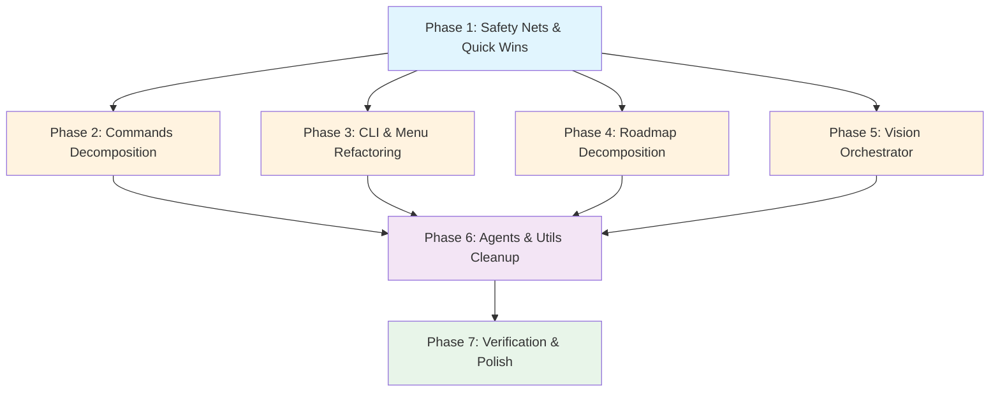
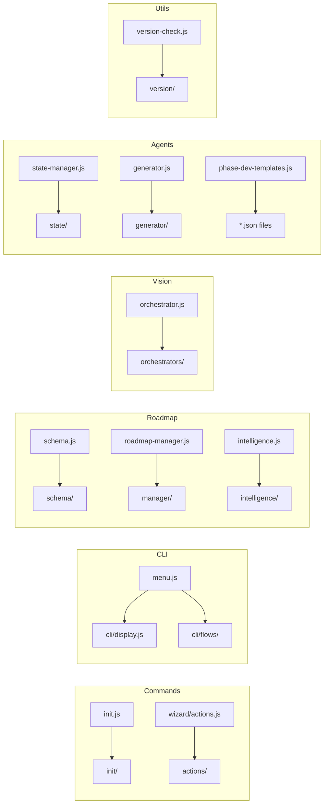

# Dependency Graph - CCASP Code Refactoring

## Phase Dependencies



## Parallel Execution Opportunities

Phases 2, 3, 4, and 5 can run in parallel after Phase 1 completes:

```
Phase 1 (Safety Nets)
    ├── Phase 2 (Commands)  ──┐
    ├── Phase 3 (CLI/Menu)  ──┤
    ├── Phase 4 (Roadmap)   ──├── Phase 6 (Agents/Utils) ── Phase 7 (Verify)
    └── Phase 5 (Vision)    ──┘
```

## File Dependency Map



## Risk Assessment

| Phase | Risk Level | Mitigation |
|-------|-----------|------------|
| Phase 1 | Low | Golden masters provide safety net |
| Phase 2 | Medium | High function count in init.js (169) - careful domain grouping needed |
| Phase 3 | Medium | Menu flows have complex state transitions - preserve navigation logic |
| Phase 4 | Medium | Schema exports widely consumed - re-export wrapper critical |
| Phase 5 | High | Largest file, most complex domain interactions - map functions first |
| Phase 6 | Low | Smaller files, patterns established from earlier phases |
| Phase 7 | Low | Verification only |
