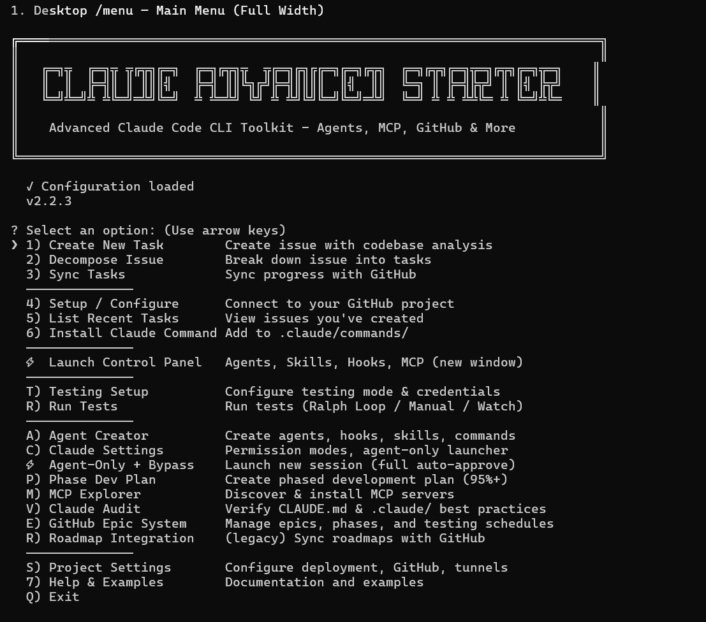
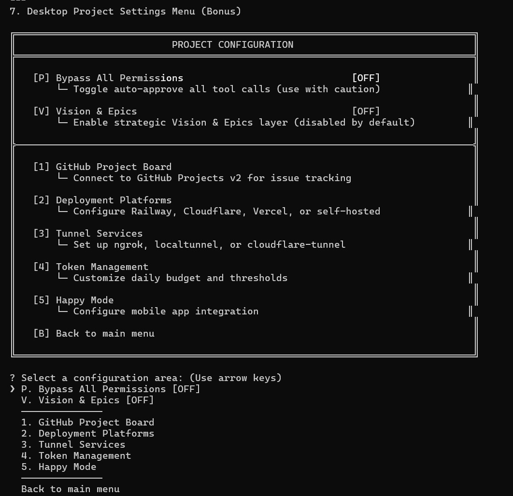
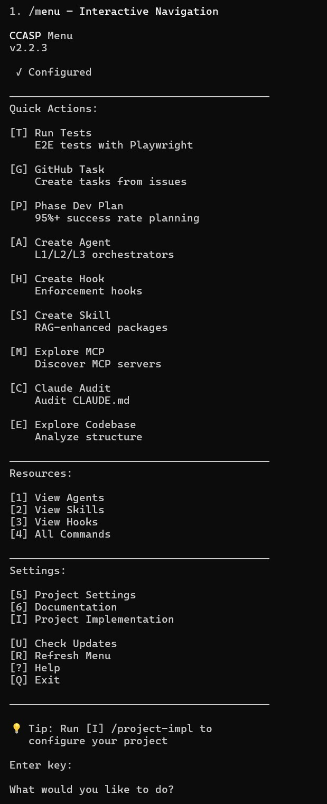
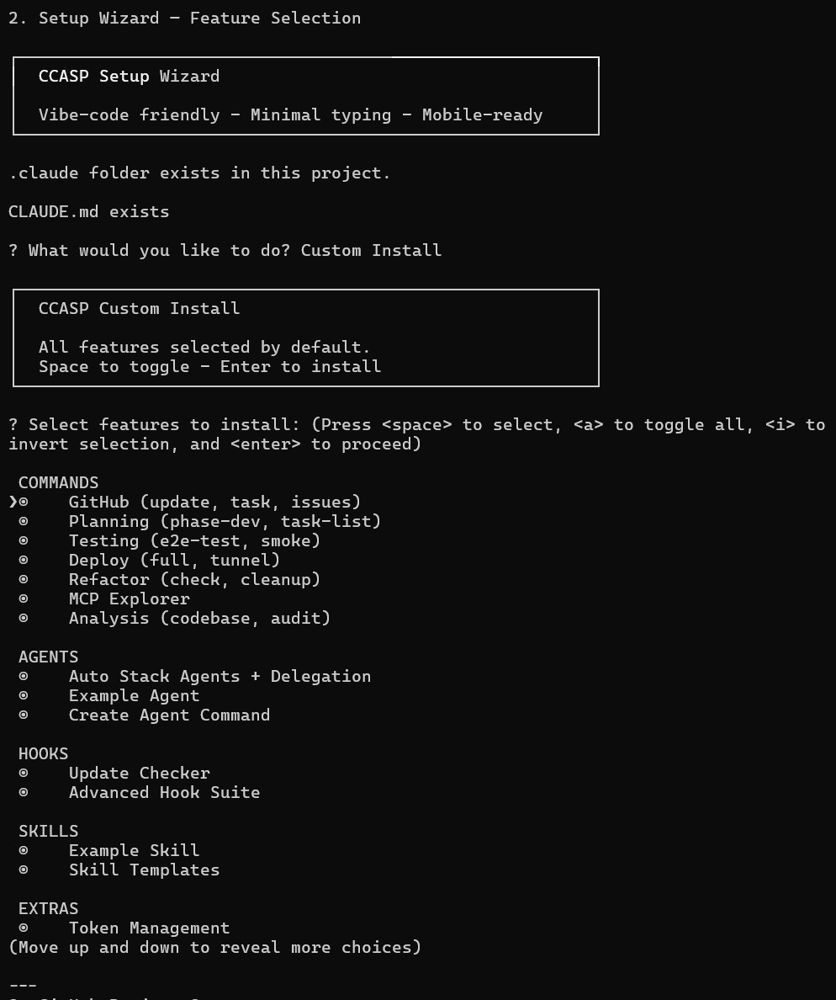
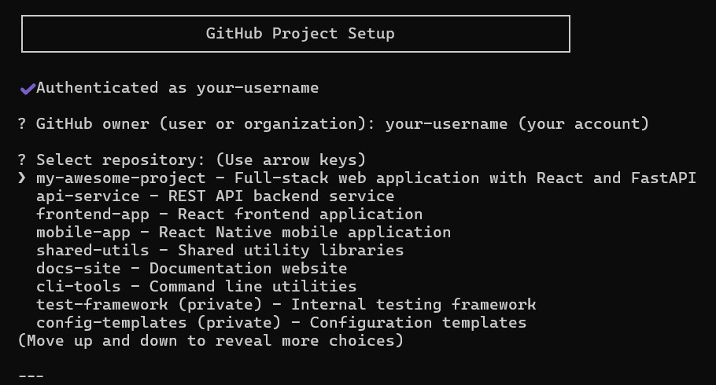
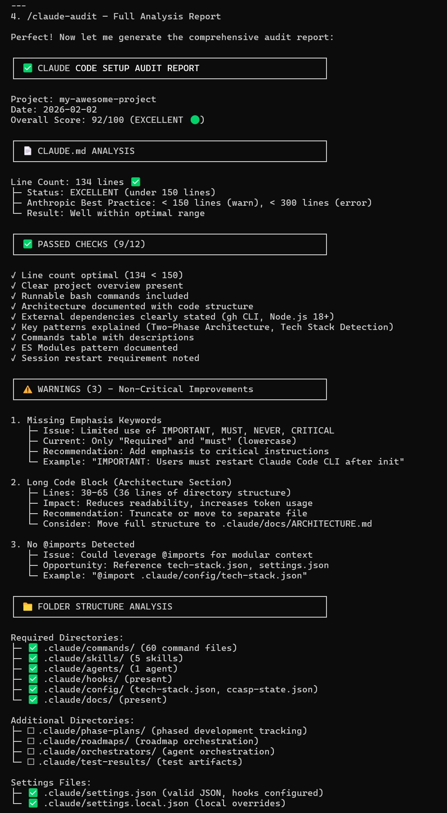
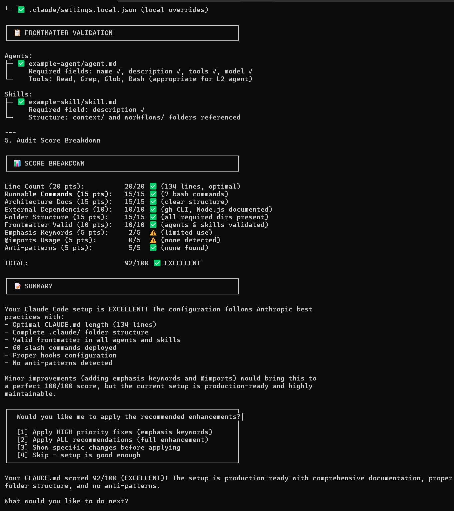
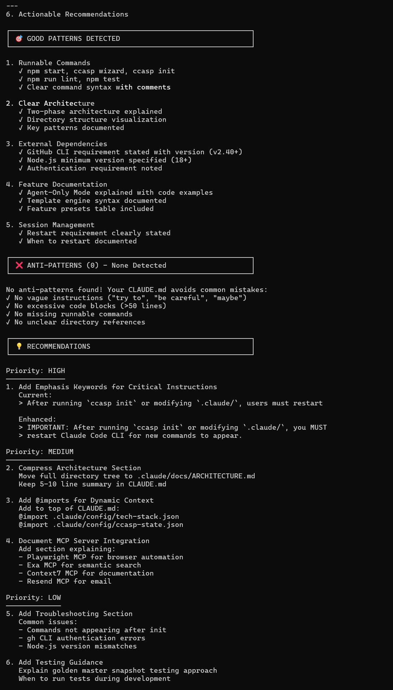

# Claude CLI Advanced Starter Pack (CCASP)

<div align="center">

```
╔═══════════════════════════════════════════════════════════════════════════════╗
║                                                                               ║
║   ╔═╗╦  ╔═╗╦ ╦╔╦╗╔═╗  ╔═╗╔╦╗╦  ╦╔═╗╔╗╔╔═╗╔═╗╔╦╗  ╔═╗╔╦╗╔═╗╦═╗╔╦╗╔═╗╦═╗       ║
║   ║  ║  ╠═╣║ ║ ║║║╣   ╠═╣ ║║╚╗╔╝╠═╣║║║║  ║╣  ║║  ╚═╗ ║ ╠═╣╠╦╝ ║ ║╣ ╠╦╝       ║
║   ╚═╝╩═╝╩ ╩╚═╝═╩╝╚═╝  ╩ ╩═╩╝ ╚╝ ╩ ╩╝╚╝╚═╝╚═╝═╩╝  ╚═╝ ╩ ╩ ╩╩╚═ ╩ ╚═╝╩╚═       ║
║                                                                               ║
║                           v2.6.1  •  Production Ready                         ║
║                                                                               ║
╚═══════════════════════════════════════════════════════════════════════════════╝
```

[](https://www.npmjs.com/package/claude-cli-advanced-starter-pack)
[](https://nodejs.org)
[](https://opensource.org/licenses/MIT)

</div>

---

<div align="center">

### Your entire Claude Code setup — customized for your stack — deployed in one command.

```bash
npx claude-cli-advanced-starter-pack init
```

[Quick Start](#quick-start) • [What You Get](#what-you-get) • [📚 Wiki](https://github.com/evan043/claude-cli-advanced-starter-pack/wiki) • [Roadmap](#roadmap)

</div>

---

<div align="center">

## v2.6.1 Feature Update — Smart Todo List with AI Intent Routing

</div>

> **Feb 2026** — New Smart Todo system: quick-add with auto-paraphrasing, interactive menu, AI-powered "Work on item" that suggests the best CCASP workflow (Vision/Epic/Roadmap/Phase-Dev/Task List), plus full Neovim integration with sidebar, floating panel, and Telescope picker.

### What's New in v2.6.1

<table>
<tr>
<td width="50%">

#### Smart Todo CLI Commands
**Two new slash commands for fast todo management:**
- **`/todo-add`** — Quick-add with auto-paraphrasing to 5-6 word titles
- **`/todo`** — Interactive menu: list, navigate, work-on, complete, delete
- **AI Paraphrasing** — Claude condenses verbose input to concise titles
- **Priority Detection** — Auto-detects urgency from keywords
- **Persistent Storage** — Single `.claude/todos.json` file

</td>
<td width="50%">

#### AI-Powered Intent Routing
**"Work on item" analyzes your todo and suggests the right workflow:**
- **Vision** — Autonomous MVP development (large scope)
- **Epic** — GitHub Epic with sub-issues (project tracking)
- **Roadmap** — Multi-milestone planning (long-term)
- **Phase-Dev** — Phased development plan (3-5 phases)
- **Task List** — Simple checklist (small scope)
- **Just do it** — Skip planning, start coding directly

</td>
</tr>
<tr>
<td width="50%">

#### Neovim Integration (3 Views)
**Full nvim-ccasp plugin support:**
- **Sidebar Section** — Todo items in existing sidebar with priority indicators
- **Floating Panel** — Full CRUD in centered floating window
- **Telescope Picker** — Fuzzy-find todos with markdown preview
- Keybindings: Enter=work, a=add, c=complete, x=delete, d=detail

</td>
<td width="50%">

#### Data Schema
**Simple, portable JSON storage:**
```json
{
  "id": "a1b2c3d4",
  "title": "Fix login redirect on mobile",
  "detail": "original verbose description...",
  "status": "pending",
  "priority": "medium",
  "routed_to": null
}
```
Cross-platform: same data in CLI and Neovim

</td>
</tr>
</table>

### Upgrade Now

```bash
# Update to v2.6.1
npm update -g claude-cli-advanced-starter-pack

# Sync new todo commands to your project
ccasp init
```

---

<div align="center">

## 🚀 v2.6.0 Feature Update — Smart Site Intel Dev-Scan System

</div>

> **Feb 2026** — New developer-focused application scanner: per-route health monitoring, data-testid coverage tracking, git-diff incremental scanning, regression detection, and interactive dashboard with 12 MCP tools.

### 🆕 What's New in v2.6.0

<table>
<tr>
<td width="50%">

#### 🔬 Smart Site Intel Dev-Scan
**Developer-focused per-route application scanning:**
- **Route Catalog** — AST-based route discovery with reverse file→route mapping
- **Config Reader** — Reads tech-stack.json, .env, playwright.config automatically
- **Playwright Scanner** — Auth, live DOM testid check, axe a11y, optional Lighthouse
- **Git Diff Integration** — Incremental scanning with 30% threshold for full scan
- **State Persistence** — Per-route scores, history (20 entries FIFO), diff tracking
- **Quick Check** — Static testid coverage in <10s (no Playwright needed)

</td>
<td width="50%">

#### 📊 Dev Scan Dashboard
**Interactive web dashboard at `http://localhost:3847`:**
- **Health Metrics** — Overall score, total routes, testid coverage, last scan
- **Sortable Route Table** — Sort by path, testid, a11y, perf, health grade
- **Color-Coded Grades** — A (green) through F (red) per-route health
- **Diff Display** — Improvements (green) and regressions (red)
- **Trend Sparklines** — Inline SVG health history per route
- **Filter Controls** — All routes, failing (<70%), regressions only
- **7 New API Endpoints** — state, summary, routes, diffs, history, testid-coverage

</td>
</tr>
<tr>
<td width="50%">

#### 🔌 3 New MCP Tools (12 Total)
**Expanded site-intel MCP server:**
- `site_intel_dev_scan` — Full/incremental per-route scan with diffs
- `site_intel_quick_check` — Fast static testid coverage (no Playwright)
- `site_intel_dev_state` — Read current state without scanning
- Updated `/site-intel` slash command with dev-scan actions
- New `/site-intel-dashboard` dedicated slash command

</td>
<td width="50%">

#### 📦 Dev-Scan Module (8 Files, ~78KB)
**Complete scanning subsystem:**
- `config-reader.js` — Project config loading (226 lines)
- `route-catalog.js` — Route discovery + reverse map (246 lines)
- `state-manager.js` — Persistent state + history (305 lines)
- `git-diff.js` — Changed file detection + route mapping (184 lines)
- `testid-checker.js` — Static analysis, 11 patterns (326 lines)
- `scanner.js` — Playwright-based scanning (361 lines)
- `diff-reporter.js` — Categorized diff output (201 lines)

</td>
</tr>
</table>

### Upgrade Now

```bash
# Update to latest
npm update -g claude-cli-advanced-starter-pack

# Sync all new features to your project
ccasp init
```

---

## The Problem

Every new project means:
- ❌ Manually creating `.claude/` folders and configurations
- ❌ Copy-pasting commands, hooks, and agents from old projects
- ❌ Forgetting critical settings and enforcement hooks
- ❌ Agents that don't understand your tech stack
- ❌ Hours of setup before you can actually build

## The Solution

**One command. Fully configured. Stack-aware.**

```bash
npx claude-cli-advanced-starter-pack init
```

CCASP scans your project, detects your stack (React? FastAPI? Prisma? Playwright?), and deploys a complete `.claude/` folder with:

- ✅ **56 slash commands** — deployment, testing, refactoring, GitHub sync
- ✅ **42 enforcement hooks** — validation, progress tracking, agent orchestration
- ✅ **Stack-specific agents** — specialists that know your frameworks
- ✅ **Smart updates** — add features without losing customizations

---

## What You Get

| Component | Count | Examples |
|-----------|-------|----------|
| **Slash Commands** | 57 | `/deploy-full`, `/pr-merge`, `/ralph`, `/site-intel-dashboard` |
| **Enforcement Hooks** | 42 | Token tracking, agent orchestration, refactor safety |
| **Tech Stack Detection** | 55+ | React, Vue, FastAPI, Express, Prisma, Playwright |
| **Agent Templates** | L1/L2/L3 | Orchestrators → Specialists → Workers |
| **MCP Integrations** | 50+ | Railway, Cloudflare, GitHub, Playwright |
| **Skills (RAG)** | 5 | agent-creator, hook-creator, refactor patterns |

---

## AI Constitution Framework

Enforce project-specific coding standards and architecture patterns with automatic validation.

### Quick Start

```bash
ccasp constitution-init --preset senior    # 5% sampling, all sections
ccasp constitution-init --preset minimal   # 2% sampling, security only
ccasp constitution-init --preset strict    # 15% sampling, maximum coverage
```

### Features

- **YAML-based rules** at `.claude/config/constitution.yaml`
- **Hook enforcement** with configurable sampling (1-in-20 default)
- **Sensitive pattern bypass** - security rules always checked
- **Stop → Explain → Suggest → Refactor** violation flow
- **Neovim integration** - edit constitution from sidebar

### Rule Sections

| Section | Examples |
|---------|----------|
| `code_style` | Naming, types, imports |
| `architecture` | Patterns, boundaries |
| `security` | Credentials, validation |
| `performance` | Async, memoization |
| `git` | Commits, branches |
| `dependencies` | Versions, security |

See `/ai-constitution-framework` in Claude Code for full documentation.

---

## See It In Action

<details>
<summary><strong>📸 Screenshots Gallery</strong> (click to expand/collapse)</summary>

<br>

### Desktop UI

<table>
<tr>
<td align="center" width="50%">
<strong>/menu — Interactive Navigation</strong><br><br>
<a href="./assets/screenshots/desktop/menu.jpg">

</a>
<br><em>Full-featured menu with all options</em>
</td>
<td align="center" width="50%">
<strong>Project Configuration Settings</strong><br><br>
<a href="./assets/screenshots/desktop/project-settings.jpg">

</a>
<br><em>GitHub, deployment, tunnels, tokens</em>
</td>
</tr>
</table>

### Mobile UI (Happy.engineering)

<table>
<tr>
<td align="center" width="50%">
<strong>/menu — Mobile Navigation</strong><br><br>
<a href="./assets/screenshots/mobile/menu.jpg">

</a>
<br><em>Single-key navigation, 40-char width</em>
</td>
<td align="center" width="50%">
<strong>Setup Wizard — Feature Selection</strong><br><br>
<a href="./assets/screenshots/mobile/setup-wizard.jpg">

</a>
<br><em>Choose commands, agents, hooks, skills</em>
</td>
</tr>
<tr>
<td align="center" width="50%">
<strong>GitHub Project Setup</strong><br><br>
<a href="./assets/screenshots/mobile/github-setup.jpg">

</a>
<br><em>One-click repo and Project Board sync</em>
</td>
<td align="center" width="50%">
<strong>/claude-audit — Analysis Report</strong><br><br>
<a href="./assets/screenshots/mobile/claude-audit-1.jpg">

</a>
<br><em>CLAUDE.md analysis with score</em>
</td>
</tr>
<tr>
<td align="center" width="50%">
<strong>Audit Score Breakdown</strong><br><br>
<a href="./assets/screenshots/mobile/claude-audit-2.jpg">

</a>
<br><em>Detailed scoring and summary</em>
</td>
<td align="center" width="50%">
<strong>Actionable Recommendations</strong><br><br>
<a href="./assets/screenshots/mobile/recommendations.jpg">

</a>
<br><em>Priority-ordered improvements</em>
</td>
</tr>
</table>

</details>

---

## Highlight Features

<table>
<tr>
<td width="50%">

### 🎯 Stack-Aware Agents

Auto-generates agents that *know* your tech:
- React + Zustand + Tailwind specialist
- FastAPI + SQLAlchemy backend agent
- Playwright E2E testing expert
- PostgreSQL + Prisma database agent

</td>
<td width="50%">

### 🔄 Ralph Loop Testing

Continuous test-fix cycle until green:
```bash
/ralph --watch
```
Runs tests → Parses failures → Fixes code → Repeats.

**Smart Recovery**: Every 3rd failed attempt deploys a web search agent to find best-practice solutions for stubborn bugs or implementation issues.

Max 10 iterations. Stops on 3x same failure.

</td>
</tr>
<tr>
<td width="50%">

### 🗺️ Multi-Phase Roadmaps

Coordinate full-stack, multi-feature development:
```bash
/create-roadmap "Q1 Feature Sprint"
```
- Break epics into phased milestones
- GitHub issue tracking per phase
- Customizable Project Board sync
- Dependency graphs with auto-ordering
- Progress dashboard across all phases

</td>
<td width="50%">

### 🚀 One-Command Deployment

Full-stack deploy to Railway + Cloudflare:
```bash
/deploy-full
```
- Backend and frontend in parallel
- Pre-flight validation
- Automatic rollback on failure

</td>
</tr>
<tr>
<td width="50%">

### 📋 Phased Development

Break complex features into phases:
```bash
/phase-dev-plan "Add user authentication"
```
- 95%+ success probability planning
- PROGRESS.json state tracking
- GitHub issue sync
- L1/L2/L3 agent orchestration

</td>
<td width="50%">

### 🔀 Safe PR Merges

9-phase merge workflow with safety:
```bash
/pr-merge
```
- Auto-stash uncommitted changes
- Resolve conflicts, CI failures, reviews
- Automatic rollback on any failure

</td>
</tr>
<tr>
<td width="50%">

### 🎫 GitHub Epic System

Multi-issue epic workflows:
```bash
/create-github-epic "Auth System"
```
- Creates parent epic with child issues
- Tracks completion across all issues
- Auto-syncs with Project Board
- Progress comments on epic issue

</td>
<td width="50%">

### 📱 Mobile-First UI

Works with [Happy.engineering](https://github.com/slopus/happy):
- 40-character max width
- Card-based layouts
- Single-character inputs
- Auto-detected via environment

</td>
</tr>
<tr>
<td colspan="2">

### 👁️ Vision Mode — Autonomous MVP Development

Transform natural language into complete, working MVPs:
```bash
ccasp vision init "Build a kanban board with real-time collaboration"
```

**8-Stage Orchestrated Workflow:**
1. **Initialize** — Parse prompt, detect intent, extract features
2. **Analyze** — Web search for inspiration, discover npm/pip packages, match MCP servers
3. **Architect** — Generate Mermaid diagrams, API contracts, ASCII wireframes
4. **Security** — Scan dependencies with npm audit, pip-audit, OSV Scanner
5. **Create Agents** — Spawn specialized agents for detected tech stack
6. **Execute** — Autonomous development loop with self-healing
7. **Validate** — Run tests, verify MVP completeness
8. **Complete** — Final verification and checkpoint creation

**Features:**
- 🎯 **Natural Language Input** — "Build a todo app with React and FastAPI"
- 🔍 **Analysis Engine** — Similar apps search, tool discovery, MCP matching
- 🏗️ **Architecture Planning** — Mermaid diagrams, API contracts, state design
- 👁️ **Drift Detection** — Hook-based observer with automatic plan adjustment
- 🔒 **Security Scanning** — Pre-install vulnerability detection
- 🤖 **Dynamic Agents** — Creates specialists based on tech stack
- 🔄 **Self-Healing** — Automatic test failure resolution
- 📊 **Web Dashboard** — Real-time status at `http://localhost:3847`

```bash
# Initialize and run
ccasp vision init "Your app idea here"
ccasp vision run my-app

# Monitor with web dashboard
ccasp vision dashboard

# Or use slash commands
/vision-init
/vision-status
/vision-run
```

</td>
</tr>
</table>

---

## Architecture

After running `ccasp init`, your project gets:

```
.claude/
├── commands/              # 56 slash commands
│   ├── menu.md           # Interactive navigation
│   ├── deploy-full.md    # Full-stack deployment
│   ├── ralph.md          # Test-fix loops
│   └── ...
├── agents/                # Stack-specific AI agents
│   ├── react-specialist.md
│   ├── fastapi-specialist.md
│   └── ...
├── hooks/                 # 42 enforcement hooks
│   ├── ralph-loop-enforcer.js
│   ├── progress-tracker.js
│   └── ...
├── skills/                # RAG-enhanced packages
├── config/
│   └── tech-stack.json    # Your detected stack
└── settings.json          # Project configuration
```

**Everything is customized** to your `package.json`, config files, and directory structure.

---

## Quick Start

```bash
# Step 1: Install
npm install -g claude-cli-advanced-starter-pack

# Step 2: Initialize (detects your stack, deploys .claude/)
ccasp init

# Step 3: Restart Claude Code CLI (required for new commands)
claude .

# Step 4: Use slash commands
/menu
```

### One-Time Use (No Install)

```bash
npx claude-cli-advanced-starter-pack init
```

---

## Roadmap

### 🚀 Coming Soon

| Feature | Status |
|---------|--------|
| **Smart Site Intel Dev-Scan** | ✅ Complete |
| **Vision Mode Orchestration** | ✅ Complete |
| **Website Intelligence (Site-Intel)** | ✅ Complete |
| **Anthropic MCP Registry** | ✅ Complete |
| **nvim-ccasp Modular Refactoring** | ✅ Complete |
| **JS Module Decomposition (Epic 3)** | ✅ Complete |
| **Jira Integration** | 🔨 In Development |
| **Linear Sync** | 🔨 In Development |
| **ClickUp Integration** | 📋 Planned |
| **Vision Driver Bot (VDB) v2** | 🔨 In Development |
| **Multi-Repo Orchestration** | 📋 Planned |

---

## Version History

### v2.6.0
**Smart Site Intel Dev-Scan System** — Feb 2026
- **Dev-Scan Module**: 8-file scanning subsystem (~78KB) for developer-focused per-route analysis
- **Dashboard Extensions**: 7 new API endpoints + Dev Scan tab with sortable route table, grade badges, sparklines, diffs
- **3 New MCP Tools**: `site_intel_dev_scan`, `site_intel_quick_check`, `site_intel_dev_state` (12 total)
- **Slash Commands**: Updated `/site-intel` with dev-scan actions, new `/site-intel-dashboard` command
- **Git Diff Integration**: Incremental scanning based on changed files with 30% threshold for full scan promotion
- **Static TestID Checker**: 11 interactive element patterns, recursive 2-level import resolution, <10s for 80+ routes
- **State Persistence**: Per-route scores with 20-entry FIFO history, regression/improvement tracking across commits
- **Barrel Exports**: Full dev-scan module exports in `src/site-intel/index.js`

### v2.5.0
**Neovim Plugin Refactoring + Site Intelligence + MCP Registry** — Feb 2026
- **nvim-ccasp 7-Phase Refactoring**: 39 files, 12,505 lines. sidebar.lua -52%, 10 new modules, health score 87/100
- **Website Intelligence System**: 5-layer MCP server (discovery, summarizer, graph, memory, judgment) with web dashboard
- **Anthropic MCP Registry**: Official API integration for 50+ verified MCP servers with auto-recommendations
- **JS Module Decomposition (Epic 3)**: 20 files decomposed into 74 focused submodules across 3 phases
- **New Hooks**: agent-guardrails, file-collision-detector, quality-check, ralph-bdd-mode, tdd-enforcer
- **New Skills**: github-actions-generator with security references
- **Test Coverage**: 15+ new test files (site-intel, token-budget, roadmap-schema, delegation-protocol, etc.)

### v2.2.19
**Neovim Integration (nvim-ccasp)** — Feb 2026
- **Zero-Setup Launcher**: `ccasp neovim` launches Neovim with CCASP pre-loaded
- **Auto-Install Neovim**: Detects winget/choco/scoop (Windows), brew (macOS), apt/dnf/pacman (Linux)
- **Multi-Session Terminals**: Up to 8 Claude CLI sessions with automatic quadrant stacking
- **Color-Coded Titlebars**: 8 colors (Blue, Green, Purple, Orange, Red, Cyan, Pink, Yellow) with rename/minimize/close
- **Auto-Insert Mode**: Click on session to start typing immediately
- **Collapsible Sidebar**: Mouse-clickable sections, all collapsed by default
- **Prompt Injector v1.1.0**: Intercept prompts, optionally enhance with GPT-5.2
- **npm Package Integration**: `nvim-ccasp/` included in npm distribution
- **Permanent Installation**: `ccasp nvim-setup` with symlink/copy options

### v2.2.18
**Critical Commands & Self-Healing Updates** — Feb 2026
- **Critical Commands**: `update-check` and `__ccasp-sync-marker` now ALWAYS update during `ccasp init`
- **Self-Healing Updates**: `/update-check` can now update itself, fixing the bootstrap problem
- **Auto-Upgrade Detection**: Missing sync marker triggers automatic `ccasp init` for full 11-category sync
- **Backwards Compatibility**: Older projects automatically upgraded to new sync system

### v2.2.17
**Auto-Run Init on Outdated Projects** — Feb 2026
- **Automatic Upgrade**: `/update-check` now runs `ccasp init` when sync marker missing
- **Zero-Touch Migration**: Users don't need to know about the upgrade — it just works

### v2.2.16
**Sync Marker System** — Feb 2026
- **New File**: `__ccasp-sync-marker.md` detects if project has full 11-category sync
- **Version Detection**: Marker indicates v2.2.16+ capabilities
- **Upgrade Path**: Clear messaging when older versions detected

### v2.2.15
**Hook File Extension Support** — Feb 2026
- **`.cjs` Support**: Hooks now support `.cjs` extension for CommonJS compatibility
- **github-progress-hook.cjs**: New hook registered for TodoWrite matcher
- **Settings Registration**: Automatic hook registration during init

### v2.2.14
**Full Template Category Sync** — Feb 2026
- **11 Categories**: `/update-check` now scans ALL template directories
- **New Categories**: commands-dev, scripts, github/ISSUE_TEMPLATE, workflows, mcp
- **Complete Coverage**: No more missing files after updates

### v2.2.13
**Simplified Update Check** — Feb 2026
- **Comprehensive Sync**: `/update-check` redesigned for complete file synchronization
- **Hash Comparison**: Detects customized files and skips them automatically
- **Smart Merge**: Preserves user modifications while adding new features

### v2.2.12
**Enhanced Issue Templates with Hook-Based Sync** — Feb 2026
- **Type-Specific Templates**: 4 templates (Feature, Refactor, Bug, Testing)
- **CCASP-META**: Machine-parseable HTML comments for agent updates
- **Generated Files Section**: All issues link to source documentation
- **Hook Infrastructure**: PostToolUse hook detects PROGRESS.json changes
- **L3 Sync Worker**: Background agent updates GitHub issues automatically
- **5-Phase Implementation**: Complete architecture from templates to testing

### v2.2.11
**Consolidated Roadmap Architecture** — Feb 2026
- **Unified Architecture**: Task/Phase/Roadmap share same exploration file structure
- **Tunnel URL Support**: Development tunnel URLs integrated into deployment workflow
- **Consistent Planning**: All three scales generate 6-file exploration documents

### v2.2.10
**Menu Display Fix** — Feb 2026
- **ASCII Box Menu**: Clean display with consistent formatting
- **Display Instructions**: Better guidance in `/menu` command

### v2.2.9
**Mandatory L2 Exploration Files** — Feb 2026
- **Enforcement**: L2 specialists MUST create exploration files before implementation
- **6-File Standard**: EXPLORATION_SUMMARY, CODE_SNIPPETS, REFERENCE_FILES, AGENT_DELEGATION, PHASE_BREAKDOWN, findings.json
- **Quality Gates**: Slash commands validate exploration docs exist

### v2.2.8
**Graduated Task/Phase/Roadmap Architecture** — Feb 2026
- **Three Planning Scales**: Tasks, Phases, and Roadmaps with unified structure
- **L2 Exploration System**: Specialists receive full context through generated docs
- **Fast Dev-Sync**: Quick synchronization for development workflows
- **Worktree Integration**: Improved dev mode with git worktree support

### v2.2.5
**Dev Mode Smart Sync & Wizard UX** — Feb 2026
- **Smart Sync for Dev Mode**: New `smart-sync.js` utility preserves user customizations when syncing from worktree
- **Menu Worktree Sync**: `[W] Sync from Worktree` option appears during dev mode with sync status banner
- **`/dev-mode-deploy-to-projects`**: New slash command with `--dry-run`, `--force`, `--project` options
- **`/menu-happy`**: Dedicated mobile menu command (40-char width) — auto-detection removed from `/menu`
- **Wizard UX Improvements**: Reinstall option, accurate template counts, better mismatch handling (#64)
- **Hook Migration**: Hooks migrated from `.js` to `.cjs` for CommonJS compatibility

### v2.2.4
**E2E Testing Integration & Happy Mode Fix** — Feb 2025
- **Comprehensive E2E Testing Integration**: Deep Playwright integration with credential injection, tunnel services, and Ralph Loop configuration
- **Happy Mode Detection Fix**: BREAKING - `HAPPY_SERVER_URL` alone no longer triggers mobile mode; requires active session indicators
- **GitHub Integration Improvements**: Enhanced error handling, cleaner issue parsing, refined MCP handling
- **Screenshot Gallery**: Added 6 screenshots showcasing desktop and mobile UI
- **Developer Guides**: New wiki sections for forking, local development, contributing, and npm updates

### v2.2.3
**Security & Packaging** — Feb 2025
- Removed hardcoded paths from npm package
- Improved template portability

### v2.2.0
**Vision Driver Bot & GitHub Epics** — Jan 2025
- **Vision Driver Bot (VDB)**: Autonomous development with lint fixes
- **GitHub Epic System**: Multi-issue epic workflows with `/create-github-epic`
- **Init for New Projects**: `/init-ccasp-new-project` for Happy users
- **Modular Commands**: 7 large files refactored for maintainability

[Full v2.2.0 Release Notes →](https://github.com/evan043/claude-cli-advanced-starter-pack/releases/tag/v2.2.0)

[View All Releases →](https://github.com/evan043/claude-cli-advanced-starter-pack/releases)

---

## Top Features

### Vision Mode Orchestration *(NEW in v2.3.0)*

Autonomous MVP development from natural language:

```bash
/vision-init "Build a task management app with drag-and-drop"
```

Vision Mode is an L0+ orchestration layer above Epics, enabling:
- **Natural Language → MVP**: Describe your product, Claude builds it autonomously
- **8-Phase Architecture**: Schema → Analysis → Architecture → Observer → Agent Factory → Security → Autonomous Execution → Integration
- **Drift Detection**: Observer hook monitors PROGRESS.json and ROADMAP.json for alignment
- **Self-Healing**: Autonomous loop retries failed tasks with intelligent fixes

```
Vision Hierarchy:
VISION (L0+) ← Natural language prompt
├── EPIC (L0) ← Generated epic with milestones
│   ├── ROADMAP (L1) ← Multi-phase roadmap
│   │   └── PHASE-DEV (L2) ← Individual phases
│   │       └── TASKS (L3) ← Atomic work units
```

Commands:
- `/vision-init` — Initialize from prompt
- `/vision-status` — View progress and alignment
- `/vision-adjust` — Adjust when drift detected

### Vision Driver Bot (VDB) *(Actively Being Developed)*

Autonomous development workflows with automatic lint fixes:

```
VDB State (.claude/vdb/state.json)
├── Current task tracking
├── Lint error queue
├── Fix history
└── Session metrics

Workflow: Detect lint errors → Queue fixes → Apply → Verify
```

### GitHub Epic System *(Actively Being Developed)*

Multi-issue epic workflows:

```bash
/create-github-epic "User Authentication System"
```
- Creates parent epic issue
- Links child issues automatically
- Tracks completion across issues
- Syncs with Project Board

### Agent Orchestration

Hierarchical agent execution:

```
L1 Orchestrator (You / Main Conversation)
├── L2 Frontend Specialist (Sonnet)
│   ├── L3 Component Search Worker (Haiku)
│   └── L3 Style Analyzer Worker (Haiku)
├── L2 Backend Specialist (Sonnet)
│   └── L3 API Discovery Worker (Haiku)
├── L2 Testing Specialist (Sonnet)
└── L2 Deployment Specialist (Sonnet)
```

### Refactoring System

```bash
# Continuous test-fix until green
/ralph --watch

# Characterization tests before refactoring
/golden-master src/utils/calculate.ts

# Guided 8-step refactoring workflow
/refactor-workflow
```

### Neovim Plugin (nvim-ccasp) *(Production Ready)*

**Zero-Setup Launch:**
```bash
ccasp neovim              # Launch with CCASP pre-loaded
ccasp neovim /path/to/dir # Launch in specific directory
ccasp nvim-setup          # Install permanently to Neovim config
```

**Features:**
- **Multi-Session Terminals**: Up to 8 Claude CLI sessions with quadrant stacking
- **Color-Coded Titlebars**: 8 colors with rename, minimize, close buttons
- **Auto-Insert Mode**: Click session to start typing immediately
- **Collapsible Sidebar**: Mouse-clickable sections, all collapsed by default
- **Control Panel**: Toggle features, change models, restart agents
- **Prompt Injector**: Intercept and enhance prompts with GPT-5.2
- **Telescope Integration**: Browse commands, skills, hooks with fuzzy finding
- **Statusline**: Token usage, agent status, version info

**Keybindings:**
| Key | Action |
|-----|--------|
| `Ctrl+B` | Toggle sidebar |
| `Ctrl+Shift+N` | New Claude session |
| `` ` `` (backtick) | Quick toggle sessions |
| `Tab` | Cycle sessions |
| `,p` | Control Panel |
| `,g` | Agent Grid |
| `,i` | Toggle Prompt Injector |

**lazy.nvim Config:**
```lua
{
  dir = "path/to/nvim-ccasp",  -- Auto-generated by ccasp neovim
  config = function()
    require("ccasp").setup({
      layout = "classic",
      sidebar = { width = 40, auto_open = true },
      terminal = { shell = "claude", size = 60 },
    })
  end,
}
```

Auto-installs Neovim on first run (winget/brew/apt detected automatically).

### Happy.engineering Mobile UI

Auto-detected. Mobile-optimized formatting:

```
┌────────────────────────────────────┐
│ [1] Issue #42                      │
│ Add JWT authentication             │
├────────────────────────────────────┤
│ Status: Ready                      │
│ Priority: High                     │
│ @johndoe • 2h ago                  │
└────────────────────────────────────┘
```

### PR Merge Workflow

```bash
/pr-merge        # Current branch
/pr-merge 123    # Specific PR
/pr-merge --dry-run
```

9 phases: Identify → Checkpoint → Detect blockers → Resolve → Message → Merge method → Execute → Cleanup → Summary

### Roadmap Orchestration

```bash
ccasp create-roadmap          # Mode A: Natural language → phases
ccasp roadmap import          # Mode B: GitHub issues → phases

/roadmap-status               # Progress dashboard
/roadmap-edit                 # Reorder, merge, split phases
/roadmap-track                # Execute with dependency checking
```

---

## Commands Reference

### Terminal Commands (No AI)

| Command | Description |
|---------|-------------|
| `ccasp wizard` | Vibe-friendly setup wizard |
| `ccasp init` | Deploy to project |
| `ccasp detect-stack` | Auto-detect tech stack |
| `ccasp create-agent` | Create L1/L2/L3 agents |
| `ccasp create-hook` | Create enforcement hooks |
| `ccasp explore-mcp` | MCP server discovery |
| `ccasp neovim` | Launch Neovim with CCASP (zero-setup) |
| `ccasp nvim-setup` | Install nvim-ccasp permanently |

### Slash Commands (AI-Powered)

| Command | Description |
|---------|-------------|
| `/menu` | Interactive navigation |
| `/deploy-full` | Full-stack deployment |
| `/pr-merge` | Safe PR merge workflow |
| `/ralph` | Test-fix loops |
| `/phase-dev-plan` | Phased development |
| `/create-github-epic` | Epic workflows |
| `/refactor-workflow` | Guided refactoring |
| `/golden-master` | Characterization tests |
| `/vision-init` | Autonomous MVP from prompt |
| `/vision-status` | Vision progress dashboard |
| `/vision-adjust` | Adjust Vision plan |
| `/site-intel` | Website intelligence + dev scanning |
| `/site-intel-dashboard` | Dev scan dashboard viewer |

[Full Commands Reference →](./docs/WIKI.md)

---

## Hook Templates (42)

| Category | Hooks |
|----------|-------|
| **Token & Session** | token-usage-monitor, session-id-generator, context-guardian |
| **Deployment** | branch-merge-checker, deployment-orchestrator |
| **Refactoring** | ralph-loop-enforcer, refactor-verify, refactor-transaction |
| **Agent Orchestration** | hierarchy-validator, progress-tracker, l2-completion-reporter |
| **Happy.engineering** | happy-mode-detector, happy-checkpoint-manager |

---

## Tech Stack Detection

Detects 55+ frameworks by reading project files (no AI):

| Category | Detected |
|----------|----------|
| **Frontend** | React, Vue, Angular, Svelte, Next.js, Nuxt, Astro |
| **Backend** | FastAPI, Express, NestJS, Django, Flask, Rails |
| **Database** | PostgreSQL, MySQL, MongoDB, SQLite, Redis |
| **ORM** | Prisma, TypeORM, SQLAlchemy, Drizzle |
| **Testing** | Jest, Vitest, Playwright, Cypress, pytest |
| **Deployment** | Railway, Vercel, Netlify, Cloudflare |

---

## MCP Server Integration

```bash
ccasp explore-mcp              # Interactive menu
ccasp explore-mcp --recommend  # Auto-recommend for your stack
```

| Category | Servers |
|----------|---------|
| **Testing** | Playwright, Puppeteer, Skyvern |
| **Deployment** | Railway, Cloudflare, Vercel |
| **Database** | PostgreSQL, Supabase, Redis |
| **Tunnel** | ngrok, Cloudflare Tunnel |

---

## Contributing

```bash
git clone https://github.com/evan043/claude-cli-advanced-starter-pack.git
cd claude-cli-advanced-starter-pack
npm install
npm run lint
npm test
```

[Contributing Guidelines →](./CONTRIBUTING.md)

---

## License

MIT © [evan043](https://github.com/evan043)

---

<div align="center">

**Stop configuring Claude Code for every project.**
**CCASP gives you a complete, stack-customized setup in one command.**

[Get Started](#quick-start) • [Documentation](./docs/WIKI.md) • [Issues](https://github.com/evan043/claude-cli-advanced-starter-pack/issues) • [npm](https://www.npmjs.com/package/claude-cli-advanced-starter-pack)

</div>
