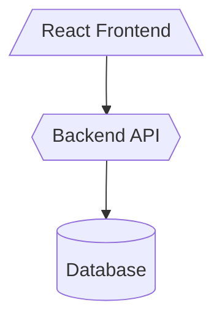
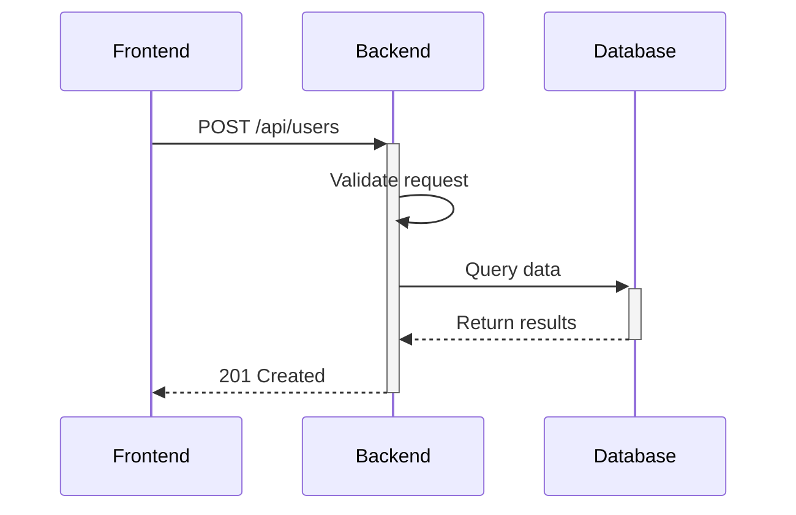

# Vision Mode Architecture Planning Module

Phase 3 of the Vision Mode roadmap - generates architecture diagrams, API contracts, and state management designs.

## Overview

This module provides tools for planning application architecture:

- **Mermaid Diagrams**: Component, data flow, sequence, and deployment diagrams
- **API Contracts**: REST endpoint definitions with OpenAPI spec generation
- **State Design**: Store structures for Zustand, Redux, Pinia, MobX

## Modules

### mermaid-generator.js

Generates valid Mermaid syntax diagrams:

```javascript
import {
  generateComponentDiagram,
  generateDataFlowDiagram,
  generateSequenceDiagram,
  generateDeploymentDiagram
} from './mermaid-generator.js';

// Component relationships
const componentDiagram = generateComponentDiagram([
  { name: 'Frontend', type: 'React', dependencies: ['Backend API'] },
  { name: 'Backend API', type: 'FastAPI', dependencies: ['Database'] }
], techStack);

// Data flow visualization
const dataFlow = generateDataFlowDiagram([
  {
    name: 'User Login',
    flows: ['User -> Auth Service', 'Auth Service -> Database']
  }
], techStack);

// API sequence diagrams
const sequence = generateSequenceDiagram([
  {
    path: '/api/users',
    method: 'POST',
    caller: 'Frontend',
    handler: 'Backend',
    usesDatabase: true
  }
]);

// Deployment architecture
const deployment = generateDeploymentDiagram(techStack);
```

### api-contracts.js

Defines REST API contracts and generates OpenAPI specs:

```javascript
import {
  generateRESTEndpoints,
  generateRequestSchema,
  generateResponseSchema,
  formatOpenAPISpec
} from './api-contracts.js';

// Generate REST endpoints from features
const endpoints = generateRESTEndpoints([
  {
    name: 'User Management',
    actions: ['create', 'read', 'update', 'delete']
  }
]);

// Generate request schema
const requestSchema = generateRequestSchema({
  path: '/api/users',
  method: 'POST',
  fields: ['name', 'email', 'password']
});

// Generate response schema
const responseSchema = generateResponseSchema({
  path: '/api/users/{id}',
  method: 'GET'
});

// Export as OpenAPI 3.0
const openApiSpec = formatOpenAPISpec(endpoints, {
  title: 'My API',
  version: '1.0.0'
});
```

### state-design.js

Plans state management structure:

```javascript
import {
  designStores,
  generateActions,
  generateStateShape
} from './state-design.js';

// Design stores (Zustand/Redux/Pinia/MobX)
const stores = designStores([
  {
    name: 'User Management',
    entities: ['user'],
    operations: ['login', 'logout']
  }
], 'zustand');

// Generate actions/mutations
const actions = generateActions({
  name: 'User',
  operations: ['login', 'logout']
}, 'zustand');

// Generate TypeScript-compatible state shape
const stateShape = generateStateShape({
  name: 'User',
  fields: ['id', 'name', 'email']
}, 'zustand');
```

## Output Examples

### Component Diagram (Mermaid)



### Sequence Diagram (Mermaid)



### OpenAPI Spec (JSON)

```json
{
  "openapi": "3.0.0",
  "info": {
    "title": "API Documentation",
    "version": "1.0.0"
  },
  "paths": {
    "/api/users": {
      "post": {
        "summary": "Create a new users",
        "requestBody": {
          "required": true,
          "content": {
            "application/json": {
              "schema": {
                "type": "object",
                "properties": {
                  "name": { "type": "string" },
                  "email": { "type": "string", "format": "email" }
                }
              }
            }
          }
        }
      }
    }
  }
}
```

### State Shape (TypeScript)

```typescript
interface UserState {
  loading: boolean;
  error: string | null;
  data: User | null;
  items: User[];
  id: string;
  name: string;
  email: string;
}
```

## Usage in Vision Mode

This module is designed to be used by Vision Mode agents during architecture planning:

1. **Component Design**: Generate component diagrams to visualize system structure
2. **API Planning**: Define REST endpoints with request/response schemas
3. **State Management**: Design stores and actions before implementation
4. **Documentation**: Auto-generate OpenAPI specs for API documentation

## Example

See `example-usage.js` for a complete demonstration of all features.

Run the example:

```bash
node src/vision/architecture/example-usage.js
```

## Integration

Import the full module:

```javascript
import * as Architecture from './src/vision/architecture/index.js';

const diagram = Architecture.generateComponentDiagram(components, techStack);
const endpoints = Architecture.generateRESTEndpoints(features);
const stores = Architecture.designStores(features, 'zustand');
```

## State Library Support

- **Zustand**: Slice pattern with middleware (devtools, persist)
- **Redux**: Slice pattern with thunk and devtools middleware
- **Pinia**: Store pattern with getters
- **MobX**: Observable pattern with computed properties
- **Vuex**: Module pattern with mutations and actions

## API Features

- Auto-infer field types from names (email, password, date, etc.)
- Generate pagination for list endpoints
- Include authentication by default
- Standard error responses (400, 404, 500)
- OpenAPI 3.0 compatible output

## Diagram Features

- Valid Mermaid syntax (tested with Mermaid live editor)
- Component styling based on type
- Subgraph support for feature grouping
- Automatic node ID sanitization
- Deployment topology visualization

---

**Part of CCASP Vision Mode - Phase 3: Architecture Planning**
