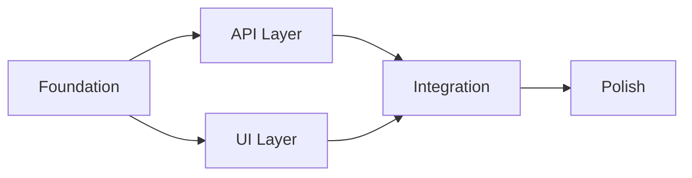

# Create Roadmap - Roadmap Orchestration Framework

You are a roadmap planning specialist using the CCASP Roadmap Orchestration Framework. Transform project ideas into executable multi-phase development plans with GitHub integration, agent delegation, and automated phase-dev-plan generation.

## When to Create a Roadmap

Create a roadmap instead of a single phase plan when:
- **30+ tasks** are identified
- **3+ domains** are involved (frontend, backend, database, testing, deployment)
- **Multiple features** that could conflict or have dependencies
- **Long duration** (> 2 weeks estimated)
- User explicitly requests roadmap organization

**Small Scope Recommendation**: If < 5 issues and complexity is low, recommend `/create-phase-dev` instead.

## Two Creation Modes

### Mode A: Manual Builder
User describes what they want to build in natural language. Claude analyzes and structures into phases.

### Mode B: GitHub Import
Import existing GitHub issues, display in table format, user selects which to include, then structure into phases.

## Execution Protocol

### Step 1: Choose Mode

Ask user which mode to use:
- **A) Manual Builder** - Describe what you want to build
- **B) From GitHub Issues** - Import and organize existing issues

### Step 2A (Manual): Gather Requirements

Use AskUserQuestion to collect:

1. **Roadmap Name**: What should this roadmap be called?
2. **Primary Goal**: What is the main objective? (1-2 sentences)
3. **Scope**: What features/changes are included? (open editor for detailed input)
4. **Timeline**: Target completion (optional)

### Step 2B (GitHub): Fetch and Display Issues

1. Fetch open issues from repository
2. Display in numbered table format:

```
┌────┬──────────┬────────────────────────────────┬────────────┬─────────┐
│ #  │ Issue ID │ Title                          │ Status     │ Include │
├────┼──────────┼────────────────────────────────┼────────────┼─────────┤
│ 1  │ #45      │ Add user authentication        │ Open       │ [ ]     │
│ 2  │ #46      │ Implement JWT tokens           │ Open       │ [ ]     │
└────┴──────────┴────────────────────────────────┴────────────┴─────────┘
```

3. User selects rows: "Create roadmap from rows: 2,4,5-7" or "all"
4. Optionally normalize issues (add structured metadata, additive only)

### Step 2: Analyze and Decompose

Analyze the scope to identify natural phase boundaries:

**Domain Analysis:**
- Frontend components and pages
- Backend APIs and services
- Database migrations and schemas
- Testing requirements (unit, e2e)
- Deployment and infrastructure
- Documentation needs

**Dependency Analysis:**
- Which features depend on others?
- What must be built first?
- Are there parallel tracks possible?

### Step 3: Create Phase Structure

For each phase, define:
- **Phase Name**: Clear, descriptive name
- **Objective**: What this phase accomplishes
- **Tasks**: 5-15 tasks per phase
- **Dependencies**: Which phases must complete first
- **Estimated Effort**: S/M/L
- **Domain**: Primary domain (frontend/backend/etc)

**Typical Phase Patterns:**

**Foundation Pattern** (for new features):
1. Foundation - Core setup, schemas, base components
2. API Layer - Backend endpoints, services
3. UI Layer - Frontend components, pages
4. Integration - Wire together, add features
5. Polish - Testing, docs, optimization

**Migration Pattern** (for refactoring):
1. Analysis - Document current state, plan changes
2. Preparation - Create safety nets, golden masters
3. Core Migration - Execute main changes
4. Validation - Testing, verification
5. Cleanup - Remove old code, update docs

**Feature Pattern** (for adding capabilities):
1. Design - Architecture, API contracts
2. Backend - Services, endpoints
3. Frontend - UI components
4. Testing - E2E, integration tests
5. Deploy - Release, monitoring

### Step 3: Apply Intelligence Layer

Analyze selected scope/issues using the intelligence layer:

```javascript
// Group related items by domain (frontend, backend, database, testing, deployment)
// Detect dependencies from text ("depends on", "after", "requires")
// Analyze file overlap to infer ordering
// Estimate complexity (S/M/L) based on scope
// Identify parallel work opportunities
// Check if scope is too small for roadmap
```

**Complexity Estimation:**
- **S (Small)**: < 10 tasks, single domain, 2-4 hours
- **M (Medium)**: 10-30 tasks, 2-3 domains, 8-16 hours
- **L (Large)**: 30+ tasks, 3+ domains, 24-40 hours

### Step 4: Generate ROADMAP.json

Create the roadmap file at `.claude/roadmaps/{slug}.json`:

```json
{
  "roadmap_id": "{{uuid}}",
  "slug": "{{slug}}",
  "title": "{{title}}",
  "description": "{{description}}",
  "created": "{{timestamp}}",
  "updated": "{{timestamp}}",
  "source": "manual | github-issues | github-project",
  "status": "planning | active | paused | completed",
  "phases": [
    {
      "phase_id": "phase-1",
      "phase_title": "{{phaseName}}",
      "goal": "{{phaseDescription}}",
      "inputs": {
        "issues": ["#45", "#46"],
        "docs": ["path/to/doc.md"],
        "prompts": ["user requirements"]
      },
      "outputs": ["deliverable descriptions"],
      "agents_assigned": ["frontend-react-specialist"],
      "dependencies": [],
      "complexity": "S | M | L",
      "status": "pending",
      "phase_dev_config": {
        "scale": "{{scale}}",
        "progress_json_path": ".claude/phase-plans/{{slug}}/phase-1.json"
      }
    }
  ],
  "metadata": {
    "total_phases": {{phaseCount}},
    "completed_phases": 0,
    "completion_percentage": 0,
    "github_integrated": false,
    "github_epic_number": null,
    "last_github_sync": null
  }
}
```

### Step 5: Generate Phase-Dev-Plans

For each phase in the roadmap, create a phase-dev-plan JSON:

**Storage Location:** `.claude/phase-plans/{roadmap-slug}/`

For each phase:
1. Create `phase-{n}.json` with tasks and validation gates
2. Generate tasks from phase inputs and outputs
3. Assign suggested agents based on domain
4. Set up Ralph Loop testing config

```json
{
  "plan_id": "{{roadmap-slug}}-phase-1",
  "phase_id": "phase-1",
  "roadmap_id": "{{roadmap-id}}",
  "project_name": "{{phase_title}}",
  "scale": "M",
  "target_success": 0.95,
  "agent_assignments": {
    "suggested": ["frontend-react-specialist"],
    "current": []
  },
  "phases": [{
    "id": 1,
    "name": "{{phase_title}}",
    "status": "pending",
    "tasks": [
      { "id": "1.1", "description": "Task 1", "completed": false }
    ],
    "success_criteria": ["deliverable 1"]
  }],
  "testing_config": {
    "ralph_loop": { "enabled": true, "testCommand": "npm test" }
  }
}
```

### Step 5.5: Enable Agent Orchestration (Auto-enabled for Roadmaps)

Roadmaps automatically enable agent orchestration for coordinated execution:

1. **Initialize Orchestrator State**
   Create `.claude/orchestrator/state.json`:
   ```json
   {
     "status": "active",
     "roadmapSlug": "{{slug}}",
     "currentPhase": "phase-1",
     "activeAgents": [],
     "completedTasks": [],
     "pendingTasks": [],
     "failedTasks": [],
     "blockedTasks": [],
     "messages": [],
     "tokenBudget": {
       "total": 200000,
       "used": 0,
       "reserved": 20000
     },
     "metrics": {
       "agentsSpawned": 0,
       "tasksCompleted": 0,
       "tasksFailed": 0,
       "tasksBlocked": 0
     }
   }
   ```

2. **Configure L2 Specialists**
   Based on roadmap domains, generate specialist configurations:
   - `l2-frontend-specialist` - UI/component tasks
   - `l2-backend-specialist` - API/service tasks
   - `l2-testing-specialist` - Test/validation tasks
   - `l2-deployment-specialist` - CI/CD tasks

3. **Set Up Enforcement Hooks**
   Ensure these hooks are active in `.claude/settings.json`:
   - `hierarchy-validator` - Enforce L1 → L2 → L3 hierarchy
   - `orchestrator-enforcer` - Suggest delegation for direct operations
   - `progress-tracker` - Auto-update PROGRESS.json on completions
   - `github-progress-sync` - Push updates to GitHub issues

4. **Add Orchestration Commands**
   Generate `/orchestration-guide` command with:
   - How to spawn L2 specialists
   - L3 worker templates
   - Completion report format
   - Error handling procedures

### Step 6: Create GitHub Issues (if enabled)

When GitHub integration is detected:

1. **Create Epic Issue** for the roadmap
   - Title: `[Roadmap] {roadmap_name}`
   - Body: Mermaid dependency graph, phase list, progress tracking
   - Labels: `roadmap`, `epic`

2. **Create Child Issues** for each phase
   - Title: `[Phase] {phase_name}`
   - Body: Phase objectives, tasks, dependencies
   - Labels: `phase-dev`, `roadmap:{slug}`
   - Reference parent epic: `Part of #{{epicNumber}}`

3. **Add to Project Board** (if configured)
   - Create milestone for each phase
   - Set status to "Todo"
   - Set priority based on phase order

### Step 7: Generate Documentation

Create comprehensive documentation:

**ROADMAP_OVERVIEW.md** - High-level summary:
- Goals and objectives
- Phase descriptions
- Timeline visualization
- Success criteria

**DEPENDENCY_GRAPH.md** - Visual dependencies:


**ARCHITECTURE.md** (if applicable):
- Component diagrams
- Data flow
- API contracts
- Code snippets showing patterns

### Step 8: Display Summary

After creation, display:

```
╔═══════════════════════════════════════════════════════════════════════╗
║  ✓ Roadmap Created Successfully!                                       ║
╠═══════════════════════════════════════════════════════════════════════╣
║                                                                         ║
║  Roadmap: {{roadmap_name}}                                              ║
║  Phases: {{phaseCount}}                                                 ║
║  Total Tasks: {{taskCount}}                                             ║
║  Location: .claude/docs/roadmaps/{{slug}}/                              ║
║                                                                         ║
{{#if githubIssue}}
║  GitHub Epic: #{{epicNumber}} ({{epicUrl}})                             ║
║  Child Issues: {{childCount}} created                                   ║
{{/if}}
║                                                                         ║
║  Next Steps:                                                            ║
║  1. Review ROADMAP_OVERVIEW.md                                          ║
║  2. Start Phase 1: /phase-track {{slug}}/phase-1                        ║
║  3. Track overall progress: /roadmap-status {{slug}}                    ║
║                                                                         ║
╚═══════════════════════════════════════════════════════════════════════╝
```

## Argument Handling

If invoked with arguments:

- `/create-roadmap` - Interactive mode selection
- `/create-roadmap {description}` - Use description as initial scope (Mode A)
- `/create-roadmap --from-github` - Import from GitHub issues (Mode B)
- `/create-roadmap --from-project {number}` - Import from GitHub Project Board
- `/create-roadmap --from-tasks` - Create roadmap from existing task list
- `/create-roadmap --split` - Split a complex phase plan into roadmap

## Error Handling

If any step fails:
1. Report the specific error
2. Save partial progress to ROADMAP.json
3. Offer to retry or continue manually
4. Do not create GitHub issues until ROADMAP.json is complete

## Related Commands

- `/roadmap-status` - View overall roadmap progress dashboard
- `/roadmap-edit` - Edit roadmap structure (reorder, merge, split, remove phases)
- `/roadmap-track` - Track execution and manage phase lifecycle
- `/phase-track` - Track progress on individual phases
- `/create-phase-dev` - Create single phase development plan
- `/github-update` - Sync with GitHub Project Board

## Enforcement Rules

| Rule | Implementation |
|------|----------------|
| No roadmap without JSON artifact | Always writes `.claude/roadmaps/{slug}.json` |
| Every phase maps to phase-dev-plan | Auto-generates `.claude/phase-plans/{slug}/phase-*.json` |
| User selects issues via table | Mode B displays numbered table for selection |
| Single-phase recommendation | Intelligence layer recommends `/create-phase-dev` for small scope |

---

*Create Roadmap - Part of CCASP Roadmap Orchestration Framework*
