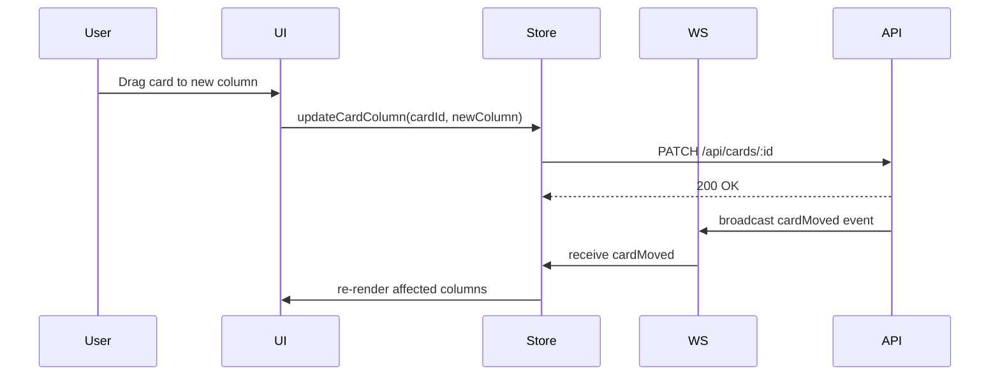
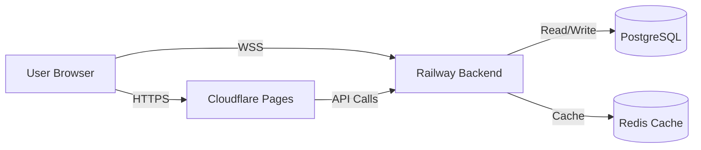

# Vision Init - Autonomous MVP Development

Transform a natural language prompt into a complete, working MVP through intelligent planning, parallel agent orchestration, and self-correcting execution loops.

**Vision Architecture:**
```
VISION (L0+) → EPIC (L0) → ROADMAP (L1) → PHASE-DEV (L2) → TASKS (L3)
```

**Key Capabilities:**
- Natural language prompt parsing
- Web search for inspiration and tools
- ASCII UI wireframe generation
- Mermaid architecture diagrams
- Hook-based observation and drift detection
- Dynamic agent creation
- Security scanning before installations
- Autonomous MVP iteration until 100% working

---

## Execution Protocol

### Step 1: Gather User Input

Use AskUserQuestion to collect:

1. **Natural Language Prompt** (required)
   - What do you want to build?
   - Example: "Build a kanban board with drag-and-drop, real-time collaboration, and mobile support"

2. **Project Title** (optional, will be generated from prompt if not provided)

3. **Priority** (optional, defaults to 'medium')
   - low / medium / high / critical

4. **Tags** (optional, comma-separated)
   - Example: "mvp, saas, real-time"

5. **Analysis Depth** (optional, defaults to 'thorough')
   - quick: Fast analysis, minimal web search
   - thorough: Deep analysis with comprehensive web search
   - exhaustive: Maximum analysis with multiple search iterations

### Step 2: Parse the Prompt

Use the Vision parser module to extract:
- Intent (build / modify / refactor / migrate / optimize)
- Features list
- Constraints (technical, business, UX)
- Quality attributes (performance, security, accessibility)
- Technologies mentioned

**Example parser output:**
```javascript
import { parseVisionPrompt } from './src/vision/parser.js';

const parsed = parseVisionPrompt(userPrompt);

// parsed structure:
{
  intent: 'build',
  features: ['kanban board', 'drag-and-drop', 'real-time collaboration', 'mobile support'],
  constraints: ['must be mobile-friendly', 'real-time required'],
  quality_attributes: ['responsive', 'real-time', 'collaborative'],
  confidence: 0.95,
  parsed_at: '2026-02-05T...'
}
```

Display parsed results to user for confirmation:
```
╔═══════════════════════════════════════════════════════════════╗
║  Vision Prompt Analysis                                       ║
╠═══════════════════════════════════════════════════════════════╣
║                                                               ║
║  Intent: BUILD                                                ║
║  Confidence: 95%                                              ║
║                                                               ║
║  Detected Features:                                           ║
║    • Kanban board                                             ║
║    • Drag-and-drop interaction                                ║
║    • Real-time collaboration                                  ║
║    • Mobile support                                           ║
║                                                               ║
║  Constraints:                                                 ║
║    • Must be mobile-friendly                                  ║
║    • Real-time updates required                               ║
║                                                               ║
║  Quality Attributes:                                          ║
║    • Responsive design                                        ║
║    • Real-time performance                                    ║
║    • Collaborative features                                   ║
║                                                               ║
╚═══════════════════════════════════════════════════════════════╝

Continue with this analysis? (yes/no/adjust)
```

If user says "adjust", allow them to modify detected features/constraints.

### Step 3: Create VISION.json

Use the Vision state manager to create and save:

```javascript
import { createAndSaveVision } from './src/vision/state-manager.js';

const result = await createAndSaveVision(projectRoot, {
  title: userTitle || generateTitleFromPrompt(userPrompt),
  prompt: userPrompt,
  tags: userTags || [],
  priority: userPriority || 'medium'
});

if (result.success) {
  console.log(`✅ Vision created: ${result.vision.slug}`);
} else {
  console.error(`❌ Failed to create vision: ${result.error}`);
}
```

**Vision is created at:** `.claude/visions/{slug}/VISION.json`

Update vision with parsed prompt data:

```javascript
import { updateVision } from './src/vision/state-manager.js';

await updateVision(projectRoot, visionSlug, (vision) => {
  vision.prompt = parsed;
  vision.metadata.estimated_complexity = estimateComplexity(parsed);
  return vision;
});
```

### Step 4: Run Web Search for Inspiration

**IMPORTANT:** Use WebSearch tool to gather:

1. **Similar Apps** (3-5 examples)
   - Search: "{features} app examples"
   - Extract: name, url, relevance, features to adopt
   - Optional: screenshot URLs

2. **UI Inspiration** (3-5 patterns)
   - Search: "{features} UI design patterns"
   - Extract: source, url, pattern name, image URLs

3. **Open Source Tools** (5-10 packages)
   - Search: "npm {technology} library" or "pip {technology} package"
   - For each package, extract:
     - package_manager (npm / pip / cargo / go)
     - package_name
     - stars (from GitHub)
     - license
     - last_updated
   - **IMPORTANT:** Set security_status to 'unknown' initially

4. **MCP Servers** (if applicable)
   - Search project's MCP server list or online registry
   - Check relevance to detected features
   - Note setup requirements

5. **Account Requirements** (detect from features)
   - Real-time → Firebase, Supabase, Pusher
   - AI features → OpenAI, Anthropic
   - Storage → S3, Cloudflare R2
   - For each, note:
     - service name
     - type (oauth / api_key / token / credentials)
     - required (boolean)
     - setup_steps
     - env_var_name

**Update VISION.json with analysis:**

```javascript
await updateVision(projectRoot, visionSlug, (vision) => {
  vision.analysis = {
    web_search: {
      similar_apps: similarApps,
      ui_inspiration: uiInspiration,
      open_source_tools: packages
    },
    mcp_servers: mcpServers,
    account_requirements: accountReqs,
    completed_at: new Date().toISOString()
  };
  vision.status = 'analyzing';
  return vision;
});
```

### Step 5: Generate ASCII UI Wireframes

Based on detected features and UI inspiration, generate ASCII wireframes:

**Example for Kanban Board:**
```
┌─────────────────────────────────────────────────────────────────────┐
│  Kanban Board                                    [+] New Board  [@] │
├─────────────────────────────────────────────────────────────────────┤
│                                                                     │
│  ┌──────────┐  ┌──────────┐  ┌──────────┐  ┌──────────┐          │
│  │  TODO    │  │  DOING   │  │  REVIEW  │  │  DONE    │          │
│  ├──────────┤  ├──────────┤  ├──────────┤  ├──────────┤          │
│  │          │  │          │  │          │  │          │          │
│  │  [Card1] │  │  [Card2] │  │  [Card3] │  │  [Card4] │          │
│  │  ≡≡≡≡≡≡≡  │  │  ≡≡≡≡≡≡≡  │  │  ≡≡≡≡≡≡≡  │  │  ≡≡≡≡≡≡≡  │          │
│  │          │  │          │  │          │  │          │          │
│  │  [Card5] │  │  [Card6] │  │          │  │  [Card7] │          │
│  │  ≡≡≡≡≡≡≡  │  │  ≡≡≡≡≡≡≡  │  │          │  │  ≡≡≡≡≡≡≡  │          │
│  │          │  │          │  │          │  │          │          │
│  │  + Add   │  │  + Add   │  │  + Add   │  │  + Add   │          │
│  │          │  │          │  │          │  │          │          │
│  └──────────┘  └──────────┘  └──────────┘  └──────────┘          │
│                                                                     │
└─────────────────────────────────────────────────────────────────────┘
```

**Component breakdown:**
```javascript
components: [
  {
    name: 'AppHeader',
    type: 'navigation',
    children: ['Logo', 'NewBoardButton', 'UserMenu'],
    props: { fixed: true, shadow: true }
  },
  {
    name: 'BoardColumn',
    type: 'draggable',
    children: ['ColumnHeader', 'CardList', 'AddCardButton'],
    props: { droppable: true, scrollable: true }
  },
  {
    name: 'Card',
    type: 'interactive',
    children: ['CardTitle', 'CardDescription', 'CardMeta'],
    props: { draggable: true, clickable: true }
  }
]
```

**Update VISION.json:**
```javascript
await updateVision(projectRoot, visionSlug, (vision) => {
  vision.wireframes = {
    ascii_ui: asciiWireframe,
    components: componentList,
    screens: [
      { name: 'Main Board', ascii: mainBoardAscii, components: ['AppHeader', 'BoardColumn'] },
      { name: 'Card Detail', ascii: cardDetailAscii, components: ['Modal', 'CardForm'] }
    ]
  };
  return vision;
});
```

### Step 6: Generate Architecture Diagrams (Mermaid)

Create Mermaid diagrams for:

**1. Component Diagram:**
```mermaid
graph TD
    App[App Component]
    App --> Header[Header]
    App --> Board[Board View]
    Board --> Column[Board Column]
    Column --> Card[Card]
    Card --> CardDetail[Card Detail Modal]

    Store[Zustand Store]
    Store --> BoardStore[Board State]
    Store --> WSStore[WebSocket State]

    API[Backend API]
    API --> BoardAPI[/api/boards]
    API --> CardAPI[/api/cards]
    API --> WS[WebSocket /ws]
```

**2. Data Flow Diagram:**


**3. Deployment Diagram:**


**Update VISION.json:**
```javascript
await updateVision(projectRoot, visionSlug, (vision) => {
  vision.architecture = {
    mermaid_diagrams: {
      component: componentDiagram,
      data_flow: dataFlowDiagram,
      sequence: sequenceDiagram,
      deployment: deploymentDiagram
    },
    tech_decisions: {
      frontend: {
        framework: 'React 19',
        reason: 'Project already uses React, native drag-and-drop support'
      },
      state: {
        library: 'Zustand',
        reason: 'Lightweight, already in project, good for real-time updates'
      },
      backend: {
        framework: 'FastAPI',
        reason: 'Primary backend, WebSocket support, async/await'
      },
      database: {
        type: 'PostgreSQL',
        reason: 'Already configured, JSONB for flexible card schema'
      },
      additional: [
        {
          category: 'Real-time',
          choice: 'WebSocket (FastAPI)',
          reason: 'Native support, low latency, bidirectional'
        },
        {
          category: 'Drag-and-Drop',
          choice: '@dnd-kit/core',
          reason: 'Modern, accessible, React 19 compatible'
        }
      ]
    },
    api_contracts: [], // Will be populated below
    state_design: {
      stores: [],
      actions: []
    }
  };
  vision.status = 'architecting';
  return vision;
});
```

**4. API Contracts:**
```javascript
const apiContracts = [
  {
    method: 'GET',
    path: '/api/boards',
    description: 'List all boards for current user',
    request_schema: null,
    response_schema: {
      boards: [{
        id: 'string',
        title: 'string',
        columns: ['string'],
        created_at: 'ISO8601'
      }]
    },
    auth_required: true
  },
  {
    method: 'POST',
    path: '/api/cards',
    description: 'Create a new card',
    request_schema: {
      board_id: 'string',
      column: 'string',
      title: 'string',
      description: 'string'
    },
    response_schema: {
      id: 'string',
      board_id: 'string',
      column: 'string',
      title: 'string',
      description: 'string',
      position: 'number',
      created_at: 'ISO8601'
    },
    auth_required: true
  },
  {
    method: 'PATCH',
    path: '/api/cards/:id',
    description: 'Update card (move column, edit content)',
    request_schema: {
      column: 'string (optional)',
      title: 'string (optional)',
      description: 'string (optional)',
      position: 'number (optional)'
    },
    response_schema: {
      id: 'string',
      board_id: 'string',
      column: 'string',
      title: 'string',
      description: 'string',
      position: 'number',
      updated_at: 'ISO8601'
    },
    auth_required: true
  }
];

// Update vision with API contracts
await updateVision(projectRoot, visionSlug, (vision) => {
  vision.architecture.api_contracts = apiContracts;
  return vision;
});
```

**5. State Design:**
```javascript
const stateDesign = {
  stores: [
    {
      name: 'boardStore',
      purpose: 'Manage boards and cards state',
      shape: {
        boards: 'Map<string, Board>',
        activeBoard: 'string | null',
        loading: 'boolean',
        error: 'string | null'
      }
    },
    {
      name: 'websocketStore',
      purpose: 'Manage WebSocket connection and real-time events',
      shape: {
        connected: 'boolean',
        connectionId: 'string | null',
        lastEvent: 'Event | null'
      }
    }
  ],
  actions: [
    {
      store: 'boardStore',
      name: 'fetchBoards',
      description: 'Load all boards from API'
    },
    {
      store: 'boardStore',
      name: 'moveCard',
      description: 'Move card to different column/position'
    },
    {
      store: 'websocketStore',
      name: 'connect',
      description: 'Establish WebSocket connection'
    },
    {
      store: 'websocketStore',
      name: 'handleCardMoved',
      description: 'Handle real-time card move event from other users'
    }
  ]
};

await updateVision(projectRoot, visionSlug, (vision) => {
  vision.architecture.state_design = stateDesign;
  return vision;
});
```

### Step 7: Detect Account/API Requirements

Based on architecture decisions, identify required accounts:

```javascript
const accountRequirements = [
  {
    service: 'Anthropic Claude',
    type: 'api_key',
    required: true,
    setup_steps: [
      'Create account at console.anthropic.com',
      'Generate API key',
      'Add to .env as ANTHROPIC_API_KEY'
    ],
    env_var_name: 'ANTHROPIC_API_KEY'
  },
  {
    service: 'Railway PostgreSQL',
    type: 'credentials',
    required: true,
    setup_steps: [
      'Already configured in project',
      'No additional setup needed'
    ],
    env_var_name: 'DATABASE_URL'
  }
];

// Update vision (if not already done in Step 4)
await updateVision(projectRoot, visionSlug, (vision) => {
  vision.analysis.account_requirements = accountRequirements;
  return vision;
});
```

### Step 8: Create GitHub Epic (Optional)

Ask user if they want to create a GitHub Epic:

```
Create a GitHub Epic for this Vision? (yes/no)
```

If yes, use the Epic hierarchy manager:

```javascript
import { createEpic } from './src/epic/epic-manager.js';

const epicResult = await createEpic(projectRoot, {
  title: vision.title,
  description: vision.prompt.original,
  labels: ['epic', 'vision-managed', ...vision.metadata.tags],
  priority: vision.metadata.priority,
  source: 'vision',
  vision_slug: vision.slug
});

if (epicResult.success) {
  // Update vision with epic reference
  await updateVision(projectRoot, visionSlug, (vision) => {
    vision.execution_plan.epic_id = epicResult.epic.epic_id;
    vision.execution_plan.epic_slug = epicResult.epic.slug;
    return vision;
  });

  console.log(`✅ GitHub Epic created: #${epicResult.epic.github_issue}`);
}
```

### Step 9: Generate Roadmaps

**IMPORTANT:** Create roadmaps based on architecture and features.

```javascript
import { createRoadmap } from './src/roadmap/roadmap-manager.js';

const roadmaps = [
  {
    order: 1,
    title: 'Backend API & Database',
    description: 'Set up PostgreSQL schema, FastAPI endpoints, WebSocket server',
    estimated_phases: 3
  },
  {
    order: 2,
    title: 'Frontend Components & State',
    description: 'Build React components, Zustand stores, drag-and-drop',
    estimated_phases: 4
  },
  {
    order: 3,
    title: 'Real-time Collaboration',
    description: 'WebSocket integration, conflict resolution, presence',
    estimated_phases: 2
  },
  {
    order: 4,
    title: 'Polish & Deployment',
    description: 'Testing, error handling, performance, deployment',
    estimated_phases: 2
  }
];

const createdRoadmaps = [];

for (const roadmap of roadmaps) {
  const result = await createRoadmap(projectRoot, {
    title: roadmap.title,
    description: roadmap.description,
    parent_epic: vision.execution_plan.epic_slug,
    vision_slug: vision.slug,
    estimated_phases: roadmap.estimated_phases
  });

  if (result.success) {
    createdRoadmaps.push({
      order: roadmap.order,
      title: roadmap.title,
      roadmap_id: result.roadmap.roadmap_id,
      roadmap_slug: result.roadmap.slug,
      status: 'pending',
      completion_percentage: 0
    });
  }
}

// Update vision with roadmap references
await updateVision(projectRoot, visionSlug, (vision) => {
  vision.execution_plan.roadmaps = createdRoadmaps;
  vision.execution_plan.estimated_phases = createdRoadmaps.reduce((sum, rm) => sum + rm.estimated_phases, 0);
  vision.execution_plan.estimated_tasks = vision.execution_plan.estimated_phases * 5; // Estimate 5 tasks per phase
  vision.status = 'orchestrating';
  return vision;
});
```

### Step 10: Create Vision-Specific Agents

Generate domain-specific agents based on tech stack:

```javascript
import { createAgent } from './src/agents/agent-builder.js';

const agents = [];

// Frontend agent (if React detected)
if (vision.architecture.tech_decisions.frontend.framework.includes('React')) {
  const frontendAgent = await createAgent(projectRoot, {
    name: `${vision.slug}-frontend`,
    domain: 'frontend',
    specialization: 'React + Zustand + UI',
    context: `Expert in ${vision.architecture.tech_decisions.frontend.framework}, ${vision.architecture.tech_decisions.state.library}, and drag-and-drop interfaces`
  });
  if (frontendAgent.success) {
    agents.push({
      name: frontendAgent.agent.name,
      domain: 'frontend',
      created_at: new Date().toISOString()
    });
  }
}

// Backend agent (if FastAPI detected)
if (vision.architecture.tech_decisions.backend.framework.includes('FastAPI')) {
  const backendAgent = await createAgent(projectRoot, {
    name: `${vision.slug}-backend`,
    domain: 'backend',
    specialization: 'FastAPI + WebSocket + PostgreSQL',
    context: `Expert in ${vision.architecture.tech_decisions.backend.framework}, WebSocket real-time communication, and ${vision.architecture.tech_decisions.database.type}`
  });
  if (backendAgent.success) {
    agents.push({
      name: backendAgent.agent.name,
      domain: 'backend',
      created_at: new Date().toISOString()
    });
  }
}

// Update vision with created agents
await updateVision(projectRoot, visionSlug, (vision) => {
  vision.execution_plan.agents_created = agents;
  return vision;
});
```

### Step 11: Display Summary and Next Steps

```
╔════════════════════════════════════════════════════════════════════╗
║                   VISION INITIALIZED SUCCESSFULLY! 🚀              ║
╠════════════════════════════════════════════════════════════════════╣
║                                                                    ║
║  Vision: {{title}}                                                 ║
║  Slug: {{slug}}                                                    ║
║  Status: {{status}}                                                ║
║  Priority: {{priority}}                                            ║
║                                                                    ║
║  📁 Location: .claude/visions/{{slug}}/VISION.json                 ║
║                                                                    ║
╠════════════════════════════════════════════════════════════════════╣
║  🔍 Analysis Complete                                              ║
╠════════════════════════════════════════════════════════════════════╣
║                                                                    ║
║  Similar Apps Found: {{similar_apps_count}}                        ║
║  UI Patterns: {{ui_patterns_count}}                                ║
║  Open Source Tools: {{tools_count}}                                ║
║  MCP Servers: {{mcp_count}}                                        ║
║  Account Requirements: {{account_req_count}}                       ║
║                                                                    ║
╠════════════════════════════════════════════════════════════════════╣
║  🎨 Wireframes Generated                                           ║
╠════════════════════════════════════════════════════════════════════╣
║                                                                    ║
║  Components Designed: {{component_count}}                          ║
║  Screens: {{screen_count}}                                         ║
║  ASCII UI Preview: ✓                                               ║
║                                                                    ║
╠════════════════════════════════════════════════════════════════════╣
║  🏗️ Architecture Planned                                           ║
╠════════════════════════════════════════════════════════════════════╣
║                                                                    ║
║  Frontend: {{frontend_framework}}                                  ║
║  State: {{state_library}}                                          ║
║  Backend: {{backend_framework}}                                    ║
║  Database: {{database_type}}                                       ║
║                                                                    ║
║  API Endpoints: {{api_count}}                                      ║
║  State Stores: {{store_count}}                                     ║
║  Mermaid Diagrams: 4                                               ║
║                                                                    ║
╠════════════════════════════════════════════════════════════════════╣
║  🗺️ Execution Plan                                                 ║
╠════════════════════════════════════════════════════════════════════╣
║                                                                    ║
{{#if epic_slug}}
║  Epic: {{epic_slug}} (GitHub #{{epic_issue}})                      ║
{{/if}}
║  Roadmaps: {{roadmap_count}}                                       ║
║  Estimated Phases: {{estimated_phases}}                            ║
║  Estimated Tasks: {{estimated_tasks}}                              ║
║                                                                    ║
{{#each roadmaps}}
║  {{order}}. {{title}} ({{estimated_phases}} phases)                ║
{{/each}}
║                                                                    ║
╠════════════════════════════════════════════════════════════════════╣
║  🤖 Agents Created                                                 ║
╠════════════════════════════════════════════════════════════════════╣
║                                                                    ║
{{#each agents}}
║  • {{name}} ({{domain}})                                           ║
{{/each}}
║                                                                    ║
╠════════════════════════════════════════════════════════════════════╣
║  ⚡ Account Setup Required                                         ║
╠════════════════════════════════════════════════════════════════════╣
║                                                                    ║
{{#each account_requirements}}
{{#if required}}
║  🔑 {{service}}                                                    ║
║     Type: {{type}}                                                 ║
║     Env Var: {{env_var_name}}                                      ║
║                                                                    ║
{{/if}}
{{/each}}
╠════════════════════════════════════════════════════════════════════╣
║  📋 Next Steps                                                     ║
╠════════════════════════════════════════════════════════════════════╣
║                                                                    ║
║  1. Review generated architecture and wireframes:                  ║
║     /vision-status {{slug}}                                        ║
║                                                                    ║
║  2. Set up required accounts (see above)                           ║
║                                                                    ║
║  3. Start autonomous execution:                                    ║
║     /vision-execute {{slug}}                                       ║
║                                                                    ║
║  4. OR start first roadmap manually:                               ║
║     /roadmap-track {{first_roadmap_slug}}                          ║
║                                                                    ║
║  5. Monitor progress and alignment:                                ║
║     /vision-status {{slug}}                                        ║
║                                                                    ║
║  6. Adjust plan if needed:                                         ║
║     /vision-adjust {{slug}}                                        ║
║                                                                    ║
╠════════════════════════════════════════════════════════════════════╣
║  🛡️ Observer Status                                                ║
╠════════════════════════════════════════════════════════════════════╣
║                                                                    ║
║  Drift Detection: ENABLED                                          ║
║  Security Scanning: ENABLED                                        ║
║  Auto-Adjustment: ENABLED                                          ║
║  Current Alignment: 100%                                           ║
║                                                                    ║
╚════════════════════════════════════════════════════════════════════╝
```

### Step 12: Save Vision Summary Document

Create `.claude/visions/{slug}/VISION_SUMMARY.md`:

```markdown
# {{title}}

**Status:** {{status}} | **Priority:** {{priority}} | **Created:** {{created}}

## Original Prompt

{{prompt.original}}

## Vision Overview

**Intent:** {{intent}} ({{confidence}}% confidence)

### Features
{{#each features}}
- {{this}}
{{/each}}

### Constraints
{{#each constraints}}
- {{this}}
{{/each}}

### Quality Attributes
{{#each quality_attributes}}
- {{this}}
{{/each}}

## Analysis Results

### Similar Apps
{{#each similar_apps}}
#### {{name}}
- **URL:** {{url}}
- **Relevance:** {{relevance}}
- **Features to Adopt:**
{{#each features_to_adopt}}
  - {{this}}
{{/each}}
{{/each}}

### UI Inspiration
{{#each ui_inspiration}}
- **{{pattern}}** from [{{source}}]({{url}})
{{/each}}

### Open Source Tools
{{#each open_source_tools}}
- **{{name}}** (`{{package_name}}`)
  - Stars: {{stars}} | License: {{license}}
  - Security: {{security_status}}
{{/each}}

### Account Requirements
{{#each account_requirements}}
- **{{service}}** ({{type}})
  - Required: {{required}}
  - Env Var: `{{env_var_name}}`
  - Setup:
{{#each setup_steps}}
    {{@index}}. {{this}}
{{/each}}
{{/each}}

## Wireframes

### ASCII UI

```
{{ascii_ui}}
```

### Components
{{#each components}}
- **{{name}}** ({{type}})
  - Children: {{children}}
  - Props: {{props}}
{{/each}}

## Architecture

### Tech Decisions

- **Frontend:** {{frontend.framework}} - {{frontend.reason}}
- **State:** {{state.library}} - {{state.reason}}
- **Backend:** {{backend.framework}} - {{backend.reason}}
- **Database:** {{database.type}} - {{database.reason}}

### Architecture Diagrams

#### Component Diagram
```mermaid
{{component_diagram}}
```

#### Data Flow
```mermaid
{{data_flow_diagram}}
```

#### Deployment
```mermaid
{{deployment_diagram}}
```

### API Contracts

{{#each api_contracts}}
#### {{method}} {{path}}

{{description}}

{{#if auth_required}}
🔒 Authentication required
{{/if}}

**Request:**
```json
{{request_schema}}
```

**Response:**
```json
{{response_schema}}
```
{{/each}}

### State Design

#### Stores
{{#each state_stores}}
- **{{name}}** - {{purpose}}
  ```typescript
  {{shape}}
  ```
{{/each}}

#### Actions
{{#each state_actions}}
- `{{store}}.{{name}}()` - {{description}}
{{/each}}

## Execution Plan

{{#if epic_slug}}
**Parent Epic:** [{{epic_slug}}](./../epics/{{epic_slug}}/EPIC.json) (GitHub #{{epic_issue}})
{{/if}}

### Roadmaps

{{#each roadmaps}}
{{order}}. **{{title}}** ({{estimated_phases}} phases)
   - Status: {{status}}
   - Completion: {{completion_percentage}}%
   - Path: `.claude/roadmaps/{{roadmap_slug}}/ROADMAP.json`
{{/each}}

**Total Estimated Phases:** {{estimated_phases}}
**Total Estimated Tasks:** {{estimated_tasks}}

### Agents Created

{{#each agents}}
- **{{name}}** ({{domain}}) - Created {{created_at}}
{{/each}}

## Observer Configuration

- **Drift Detection:** Enabled
- **Security Scanning:** Enabled
- **Auto-Adjustment:** Enabled
- **Alignment Target:** 95%+

## Files Generated

| File | Path |
|------|------|
| Vision Config | `.claude/visions/{{slug}}/VISION.json` |
| Vision Summary | `.claude/visions/{{slug}}/VISION_SUMMARY.md` |
{{#if epic_slug}}
| Epic Config | `.claude/epics/{{epic_slug}}/EPIC.json` |
{{/if}}
{{#each roadmaps}}
| Roadmap {{order}} | `.claude/roadmaps/{{roadmap_slug}}/ROADMAP.json` |
{{/each}}

---

*Generated by Vision Mode - CCASP Autonomous Development Framework*
*Last Updated: {{updated}}*
```

## Argument Handling

If invoked with arguments:

- `/vision-init` - Interactive mode (default)
- `/vision-init {prompt}` - Quick start with prompt
- `/vision-init --prompt "{prompt}" --title "{title}" --priority {priority}` - Full specification
- `/vision-init --quick` - Skip confirmation steps, use defaults

**Examples:**

```bash
/vision-init

/vision-init Build a kanban board with drag-and-drop and real-time collaboration

/vision-init --prompt "Create a markdown editor with live preview and GitHub sync" --title "MD Editor Pro" --priority high

/vision-init --quick --prompt "Build a task tracker"
```

## Validation Checklist

Before marking complete, verify:

```
[ ] VISION.json created in .claude/visions/{slug}/
[ ] Prompt parsed with confidence > 70%
[ ] Web search completed (similar apps, UI patterns, tools)
[ ] ASCII wireframes generated with component breakdown
[ ] 4 Mermaid diagrams created (component, data flow, sequence, deployment)
[ ] Tech decisions documented with reasons
[ ] API contracts defined
[ ] State design defined
[ ] Account requirements identified
[ ] Roadmaps created and linked
[ ] Agents created for detected tech stack
[ ] VISION_SUMMARY.md generated
[ ] Epic created on GitHub (if user requested)
[ ] Observer enabled with drift detection
[ ] Security scanning enabled
```

## Error Handling

If any step fails:
1. Log error details
2. Save partial VISION.json with status 'failed'
3. Display error to user with recovery steps
4. Offer to retry failed step or continue without it

## Related Commands

- `/vision-status` - View Vision status and progress
- `/vision-adjust` - Adjust Vision plan
- `/vision-execute` - Start autonomous execution
- `/roadmap-track` - Track specific roadmap

---

*Vision Init - Part of CCASP Vision Mode Autonomous Development Framework*
