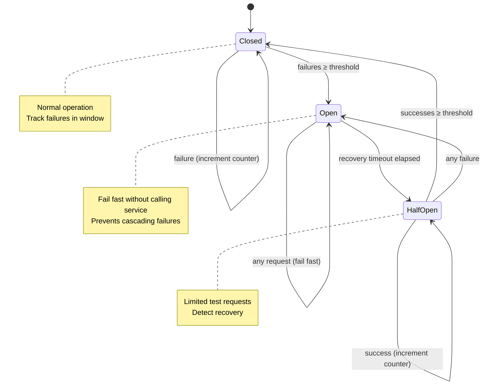

# Circuit Breaker Pattern

Fail-fast pattern that prevents cascading failures in external system interactions.

## Overview

The Circuit Breaker pattern monitors failures and automatically stops attempting operations that are likely to fail, allowing the failing system to recover while preventing resource exhaustion and long timeouts.

## The Problem

Without a circuit breaker:
- Repeated calls to failing services waste resources
- Cascading timeouts accumulate, blocking execution
- External system overload prevents recovery
- No automatic recovery detection

## States

```
┌─────────────────────────────────────────────────────────┐
│                   Circuit Breaker States                │
└─────────────────────────────────────────────────────────┘

   [CLOSED]                 [OPEN]                [HALF-OPEN]
  Normal Operation       Failing Fast           Testing Recovery
        │                     ▲                        │
        │ failures ≥          │                        │
        │ threshold           │ timeout                │ success
        └─────────────────────┘                        └─────────┐
                                                                  │
                             failure                              │
                          ┌───────────────────────────────────────┘
                          │
                          ▼
                       [OPEN]
                    (reset timeout)
```

### 1. Closed (Normal)
- Requests pass through to external system
- Failure counter tracks recent failures
- On threshold breach → transition to Open

### 2. Open (Failing Fast)
- All requests fail immediately without calling external system
- After recovery timeout → transition to Half-Open
- Prevents resource waste on known-failing operations

### 3. Half-Open (Testing)
- Limited requests allowed through to test recovery
- On success → transition to Closed (system recovered)
- On failure → transition back to Open (still broken)

## Configuration

```typescript
interface CircuitBreakerConfig {
  // State transition thresholds
  failureThreshold: number;        // Failures before opening (default: 5)
  successThreshold: number;        // Successes to close from half-open (default: 2)

  // Timing
  recoveryTimeout: number;         // ms before trying half-open (default: 60000)
  requestTimeout: number;          // ms per request (default: 10000)

  // Sliding window for failure counting
  windowSize: number;              // Track last N requests (default: 10)
  windowTime: number;              // Or last N milliseconds (default: 60000)

  // Half-open behavior
  halfOpenMaxAttempts: number;     // Max concurrent half-open requests (default: 1)
}
```

## Claude Code Context

Use circuit breakers for:

### 1. MCP Server Calls
```typescript
// MCP servers may be flaky or rate-limited
const mcpBreaker = new CircuitBreaker(callMCPServer, {
  failureThreshold: 3,
  recoveryTimeout: 30000,
  requestTimeout: 5000
});

// Fails fast if MCP server is down
const result = await mcpBreaker.execute('mcp__github__get_issue', args);
```

### 2. GitHub API Calls
```typescript
// GitHub API has rate limits
const ghBreaker = new CircuitBreaker(callGitHubAPI, {
  failureThreshold: 5,
  recoveryTimeout: 60000,  // Wait longer for rate limit reset
  windowTime: 60000         // Track failures per minute
});

await ghBreaker.execute('GET', '/repos/owner/repo/pulls');
```

### 3. External Tool Invocations
```typescript
// Tools like Railway CLI, Wrangler may fail
const deployBreaker = new CircuitBreaker(deployToRailway, {
  failureThreshold: 2,
  recoveryTimeout: 120000,  // Deployments need longer recovery
  requestTimeout: 300000    // 5 min timeout per deploy
});

await deployBreaker.execute(deploymentConfig);
```

### 4. Agent Spawning
```typescript
// Prevent runaway agent spawning if quota exceeded
const agentBreaker = new CircuitBreaker(spawnAgent, {
  failureThreshold: 3,
  recoveryTimeout: 60000,
  halfOpenMaxAttempts: 1  // Test with single agent first
});

const agent = await agentBreaker.execute(agentConfig);
```

## Implementation

```typescript
class CircuitBreaker {
  private state: 'closed' | 'open' | 'half-open' = 'closed';
  private failureCount = 0;
  private successCount = 0;
  private lastFailureTime: number | null = null;
  private nextAttemptTime: number | null = null;
  private halfOpenAttempts = 0;

  constructor(
    private operation: (...args: any[]) => Promise<any>,
    private config: CircuitBreakerConfig = {}
  ) {
    // Defaults
    this.config.failureThreshold ??= 5;
    this.config.successThreshold ??= 2;
    this.config.recoveryTimeout ??= 60000;
    this.config.requestTimeout ??= 10000;
    this.config.halfOpenMaxAttempts ??= 1;
  }

  async execute(...args: any[]): Promise<any> {
    // Check if we should transition from Open to Half-Open
    if (this.state === 'open' && this.shouldAttemptReset()) {
      this.state = 'half-open';
      this.halfOpenAttempts = 0;
      console.log('[CircuitBreaker] Transitioning to HALF-OPEN');
    }

    // Fail fast if open
    if (this.state === 'open') {
      throw new CircuitBreakerOpenError(
        `Circuit breaker open. Next attempt at ${new Date(this.nextAttemptTime!)}`
      );
    }

    // Limit concurrent attempts in half-open
    if (this.state === 'half-open') {
      if (this.halfOpenAttempts >= this.config.halfOpenMaxAttempts!) {
        throw new CircuitBreakerOpenError('Half-open max attempts exceeded');
      }
      this.halfOpenAttempts++;
    }

    try {
      // Execute with timeout
      const result = await this.executeWithTimeout(args);

      // Success handling
      this.onSuccess();
      return result;
    } catch (error) {
      // Failure handling
      this.onFailure();
      throw error;
    }
  }

  private async executeWithTimeout(args: any[]): Promise<any> {
    return Promise.race([
      this.operation(...args),
      new Promise((_, reject) =>
        setTimeout(
          () => reject(new Error('Request timeout')),
          this.config.requestTimeout
        )
      )
    ]);
  }

  private onSuccess(): void {
    if (this.state === 'half-open') {
      this.successCount++;
      if (this.successCount >= this.config.successThreshold!) {
        console.log('[CircuitBreaker] Transitioning to CLOSED (recovered)');
        this.state = 'closed';
        this.failureCount = 0;
        this.successCount = 0;
        this.lastFailureTime = null;
        this.nextAttemptTime = null;
      }
    } else if (this.state === 'closed') {
      // Reset failure count on success in closed state
      this.failureCount = Math.max(0, this.failureCount - 1);
    }
  }

  private onFailure(): void {
    this.failureCount++;
    this.lastFailureTime = Date.now();

    if (this.state === 'half-open') {
      // Immediate transition back to open
      console.log('[CircuitBreaker] Transitioning to OPEN (half-open failure)');
      this.tripBreaker();
    } else if (this.state === 'closed') {
      // Check if threshold breached
      if (this.failureCount >= this.config.failureThreshold!) {
        console.log(`[CircuitBreaker] Transitioning to OPEN (${this.failureCount} failures)`);
        this.tripBreaker();
      }
    }
  }

  private tripBreaker(): void {
    this.state = 'open';
    this.nextAttemptTime = Date.now() + this.config.recoveryTimeout!;
    this.successCount = 0;
    this.halfOpenAttempts = 0;
  }

  private shouldAttemptReset(): boolean {
    return this.nextAttemptTime !== null && Date.now() >= this.nextAttemptTime;
  }

  // Inspection methods
  getState(): string {
    return this.state;
  }

  getMetrics() {
    return {
      state: this.state,
      failureCount: this.failureCount,
      successCount: this.successCount,
      nextAttemptTime: this.nextAttemptTime
    };
  }

  // Manual controls (use sparingly)
  reset(): void {
    this.state = 'closed';
    this.failureCount = 0;
    this.successCount = 0;
    this.lastFailureTime = null;
    this.nextAttemptTime = null;
  }

  forceOpen(): void {
    this.tripBreaker();
  }
}

class CircuitBreakerOpenError extends Error {
  constructor(message: string) {
    super(message);
    this.name = 'CircuitBreakerOpenError';
  }
}
```

## Usage Example

```typescript
import { CircuitBreaker } from './circuit-breaker';

// Wrap MCP server calls
const mcpBreaker = new CircuitBreaker(
  async (server: string, method: string, args: any) => {
    // Actual MCP call
    return await mcp__call(server, method, args);
  },
  {
    failureThreshold: 3,
    recoveryTimeout: 30000,
    requestTimeout: 5000
  }
);

// Use in command
async function executeWithProtection() {
  try {
    const result = await mcpBreaker.execute(
      'github',
      'get_issue',
      { repo: 'owner/repo', issue: 123 }
    );
    console.log('Success:', result);
  } catch (error) {
    if (error instanceof CircuitBreakerOpenError) {
      console.log('⚠️ Service temporarily unavailable, failing fast');
      // Use fallback or cached data
    } else {
      console.error('Operation failed:', error.message);
    }
  }
}

// Check breaker health
console.log(mcpBreaker.getMetrics());
// → { state: 'closed', failureCount: 0, ... }
```

## When to Use

Use circuit breakers when:

- Calling rate-limited APIs (GitHub, Railway, etc.)
- Invoking flaky external services (MCP servers)
- Network-dependent operations prone to transient failures
- Operations with expensive timeouts
- Need to prevent cascading failures across dependent systems

## When NOT to Use

Don't use circuit breakers for:

- One-off operations (no pattern of failures to detect)
- Operations with no external dependencies
- Fast-failing operations (already fail quickly)
- Non-retryable errors (circuit breaker won't help)

## Configuration Guidelines

### Conservative (Production)
```typescript
{
  failureThreshold: 5,      // Allow 5 failures
  recoveryTimeout: 60000,   // Wait 1 minute
  successThreshold: 3       // Need 3 successes to trust recovery
}
```

### Aggressive (Development)
```typescript
{
  failureThreshold: 2,      // Fail fast
  recoveryTimeout: 10000,   // Quick retry
  successThreshold: 1       // Trust first success
}
```

### Rate-Limited APIs
```typescript
{
  failureThreshold: 3,
  recoveryTimeout: 300000,  // 5 min (typical rate limit window)
  windowTime: 60000,        // Count failures per minute
  halfOpenMaxAttempts: 1    // Single test request
}
```

## Monitoring

```typescript
// Add metrics tracking
class MonitoredCircuitBreaker extends CircuitBreaker {
  private stateChanges: { from: string; to: string; at: number }[] = [];

  protected onStateChange(from: string, to: string): void {
    this.stateChanges.push({ from, to, at: Date.now() });

    // Log to monitoring system
    console.log(`[CircuitBreaker] ${from} → ${to}`);

    // Alert on open state
    if (to === 'open') {
      this.alertOnOpen();
    }
  }

  private alertOnOpen(): void {
    console.warn('⚠️ Circuit breaker OPEN - failing fast to protect system');
  }

  getHistory() {
    return this.stateChanges;
  }
}
```

## State Diagram (Mermaid)



## Anti-Patterns

### 1. No Timeout
```typescript
// BAD: No timeout, breaker won't trip on hangs
await breaker.execute(longRunningOperation);

// GOOD: Configure timeout
const breaker = new CircuitBreaker(operation, {
  requestTimeout: 10000
});
```

### 2. Too Aggressive Threshold
```typescript
// BAD: Opens on first failure (too sensitive)
{ failureThreshold: 1 }

// GOOD: Allow for transient failures
{ failureThreshold: 5 }
```

### 3. Shared Breaker for Different Operations
```typescript
// BAD: One breaker for all operations
const breaker = new CircuitBreaker(genericCall, config);
await breaker.execute('github', args);
await breaker.execute('railway', args);  // Opens both if either fails!

// GOOD: Separate breakers per service
const githubBreaker = new CircuitBreaker(callGitHub, config);
const railwayBreaker = new CircuitBreaker(callRailway, config);
```

## Related Patterns

- **Retry with Backoff**: Use circuit breaker AFTER retry exhausted
- **Timeout Pattern**: Circuit breaker includes timeout functionality
- **Bulkhead Pattern**: Isolate circuit breakers per resource pool

---

*Circuit Breaker Pattern - CCASP v2.3.0*
*Prevents cascading failures in external system interactions*
